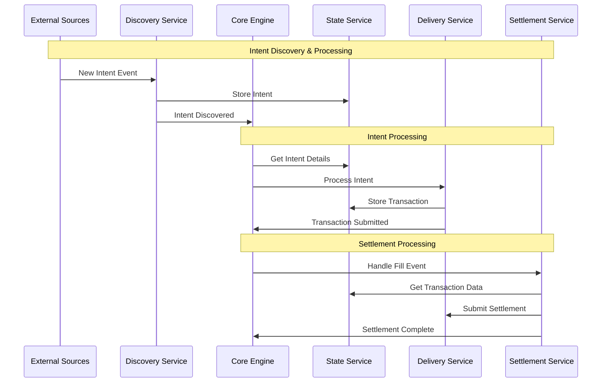
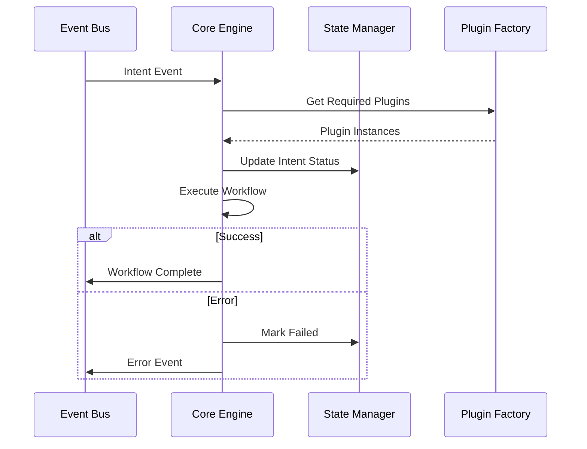
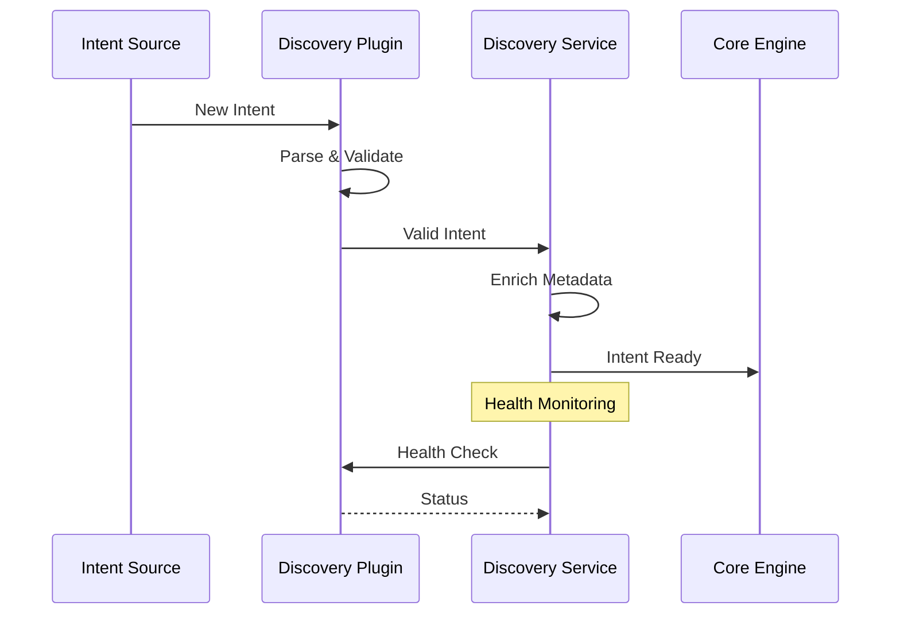
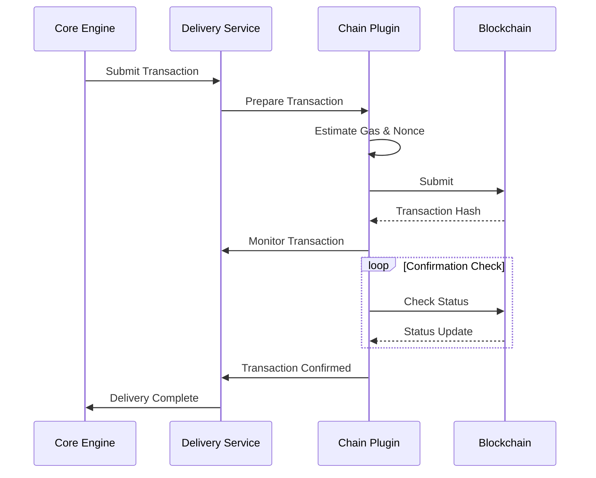
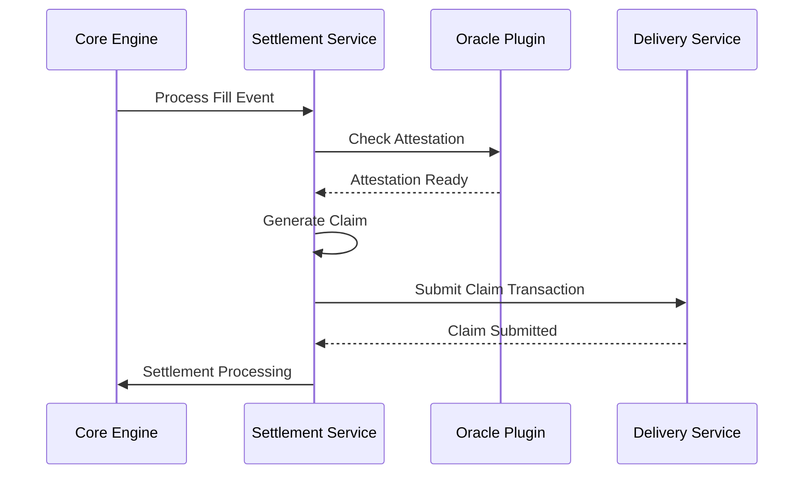
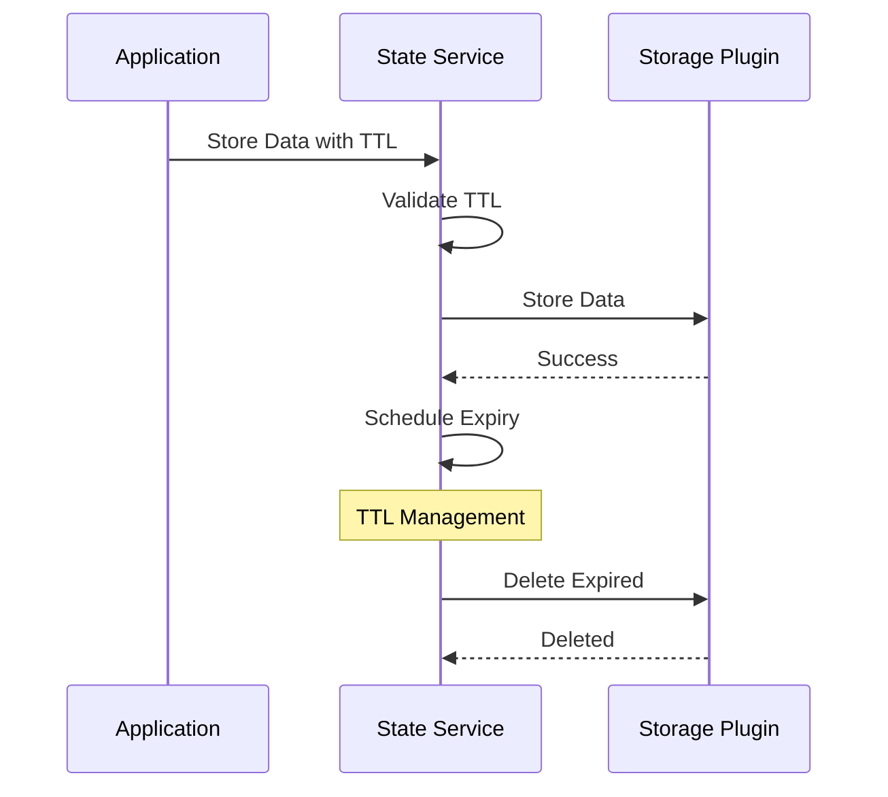

# OIF Solver Plugin Architecture Proposal

## Executive Summary

The OIF Solver adopts a **plugin-based architecture** that transforms the traditional monolithic solver design into a modular, extensible toolkit. This architecture enables third parties to leverage individual components or deploy the complete solution, promoting reusability and customization while maintaining system coherence.

## High-Level File Structure

```
oif-solver/
├── crates/
│   ├── solver-core/          # Main orchestration engine
│   ├── solver-discovery/     # Intent/order discovery service
│   ├── solver-delivery/      # Transaction submission service
│   ├── solver-settlement/    # Settlement verification service
│   ├── solver-state/         # Persistent storage service
│   ├── solver-plugin/        # Plugin implementations
│   ├── solver-types/         # Shared types and interfaces
│   ├── solver-config/        # Configuration management
│   └── solver-service/       # HTTP API and CLI interface
├── config/                   # Configuration files
├── scripts/                  # Demo and utility scripts
└── oif-contracts/           # Smart contract implementations
```

## Directory Responsibilities

- **solver-core**: Orchestrates the entire solver workflow and coordinates between services
- **solver-discovery**: Discovers new intents/orders from various blockchain and off-chain sources
- **solver-delivery**: Handles transaction preparation, submission, and monitoring across multiple chains
- **solver-settlement**: Manages settlement verification and claim processing after transaction execution
- **solver-state**: Provides persistent storage abstraction with TTL management for solver state
- **solver-plugin**: Contains concrete plugin implementations for different protocols and chains
- **solver-types**: Defines shared data structures, traits, and interfaces used across all components
- **solver-config**: Manages configuration parsing, validation, and runtime settings
- **solver-service**: Exposes HTTP API endpoints and CLI interface for external interaction

## High-Level System Flow



## Module Deep Dive

### Core Engine

**Responsibility**: Orchestrates the complete solver workflow from intent discovery to settlement completion.



### Discovery Service

**Responsibility**: Monitors multiple sources for new intents and validates them before processing.



### Delivery Service

**Responsibility**: Handles transaction lifecycle from preparation to confirmation across multiple blockchains.



### Settlement Service

**Responsibility**: Verifies settlement conditions and orchestrates claim processing.



### State Service

**Responsibility**: Provides persistent storage abstraction with automatic TTL management.



## Benefits

### Modularity

- Each component has clear boundaries and responsibilities
- Independent testing and development of individual services
- Simplified debugging through isolated components

### Extensibility

- New protocols supported by adding plugins without core changes
- Third parties can implement custom plugins for specific needs
- Gradual migration and protocol upgrades through plugin versioning

### Reusability

- Components can be used independently in other projects
- Discovery service useful for any blockchain monitoring needs
- Delivery service applicable to any transaction submission system

### Flexibility

- Mix and match plugins based on deployment requirements
- Deploy minimal configurations for specific use cases
- Scale individual services independently based on load

## Drawbacks & Mitigations

### Complexity

- **Issue**: Plugin interfaces add abstraction layers
- **Mitigation**: Comprehensive documentation, clear examples, and developer tooling

### Performance Overhead

- **Issue**: Dynamic dispatch and trait object costs
- **Mitigation**: Use static dispatch where possible, profile critical paths

### Configuration Management

- **Issue**: Complex configuration with many plugin options
- **Mitigation**: Sensible defaults, configuration templates, and validation

## Toolkit Usage Examples

### Standalone Discovery Library

```rust
use solver_discovery::DiscoveryService;
use solver_plugin::discovery::Eip7683Plugin;

// Monitor blockchain for new intents
let plugins = vec![Box::new(Eip7683Plugin::new(config))];
let discovery = DiscoveryService::new(plugins);

discovery.start().await?;
// Service emits events when intents are discovered
```

### Transaction Delivery Library

```rust
use solver_delivery::DeliveryService;
use solver_plugin::delivery::EthersPlugin;

// Submit transactions to any EVM chain
let plugins = vec![Box::new(EthersPlugin::new(chain_config))];
let delivery = DeliveryService::new(plugins);

let result = delivery.submit_transaction(tx_data).await?;
println!("Transaction hash: {}", result.tx_hash);
```

### State Management Service

```rust
use solver_state::StateService;
use solver_plugin::state::FilePlugin;

// Persistent storage with TTL
let plugins = vec![Box::new(FilePlugin::new("./data"))];
let state = StateService::new(plugins);

state.store("key", "value", Duration::from_secs(3600)).await?;
let value = state.get("key").await?;
```

### Custom Settlement Integration

```rust
use solver_settlement::SettlementService;
use solver_plugin::settlement::DirectPlugin;

// Process settlement claims
let plugins = vec![Box::new(DirectPlugin::new(oracle_config))];
let settlement = SettlementService::new(plugins);

settlement.process_fill_event(fill_data).await?;
```

## Conclusion

The plugin-based architecture transforms the OIF Solver into a flexible, reusable toolkit that balances modularity with performance. This design enables developers to integrate specific components, operators to deploy customized configurations, and the broader ecosystem to evolve through community-contributed plugins.
