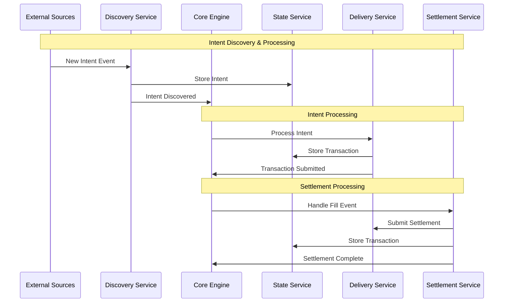
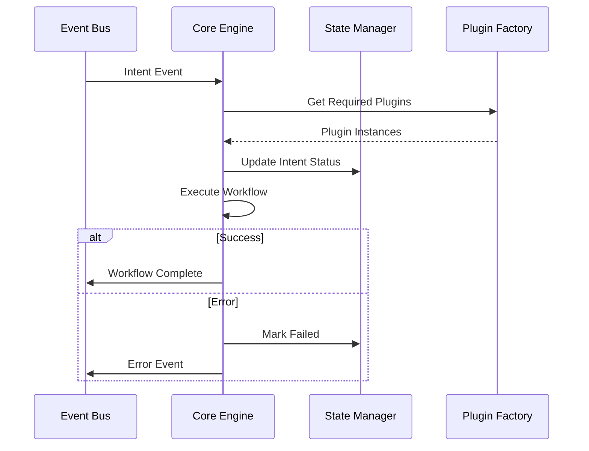
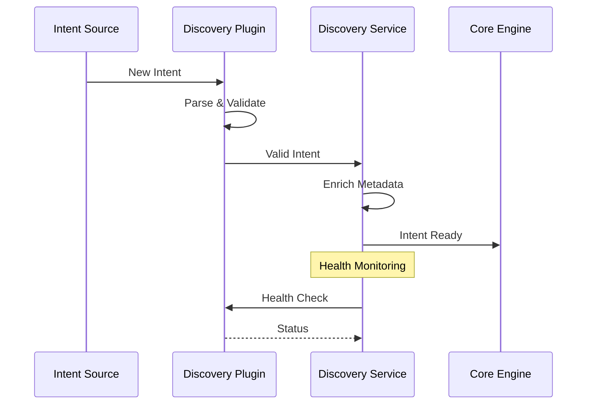
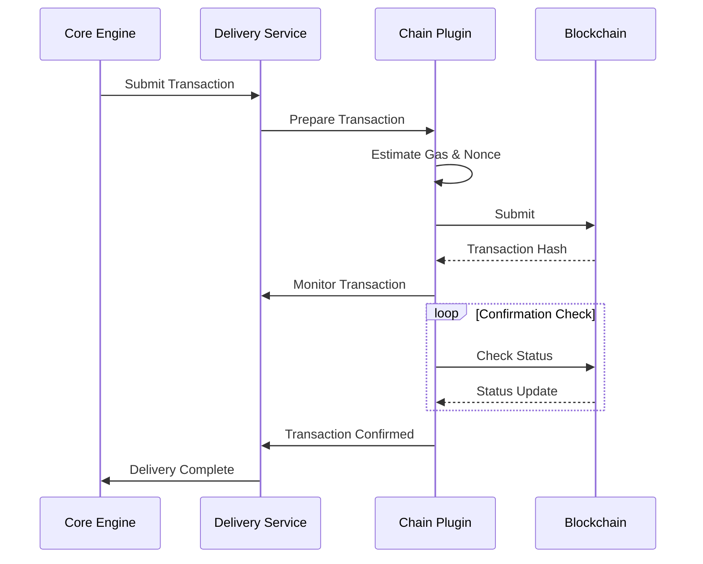
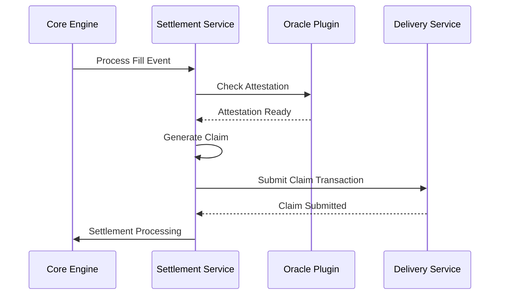
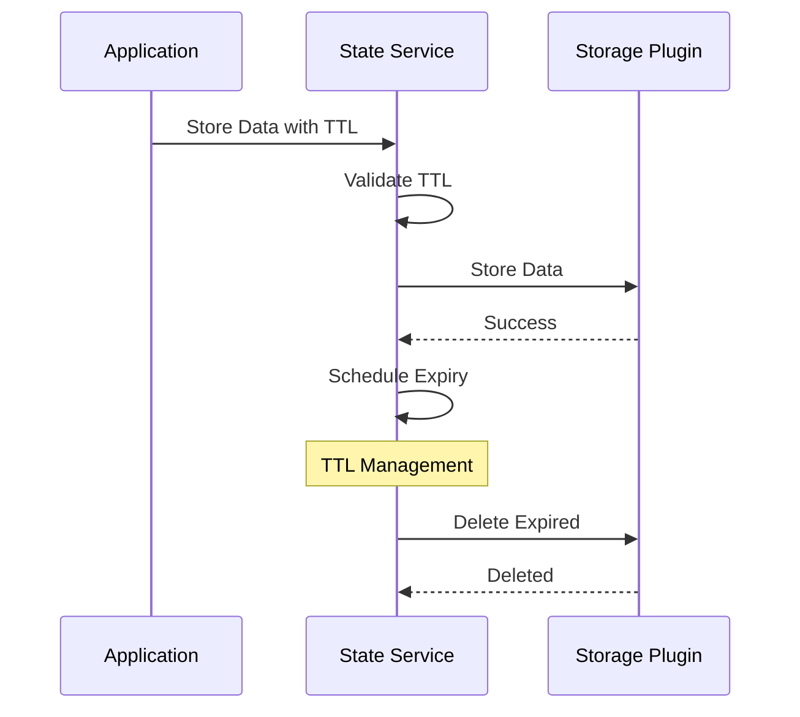

# OIF Solver Plugin Architecture Proposal

## Executive Summary

The OIF Solver adopts a **plugin-based architecture** that transforms the traditional monolithic solver design into a modular, extensible toolkit. This architecture enables third parties to leverage individual components or deploy the complete solution, promoting reusability and customization while maintaining system coherence.

## High-Level File Structure

```
oif-solver/
├── crates/
│   ├── solver-core/          # Main orchestration engine
│   ├── solver-discovery/     # Intent/order discovery service
│   ├── solver-delivery/      # Transaction submission service
│   ├── solver-settlement/    # Settlement verification service
│   ├── solver-state/         # Persistent storage service
│   ├── solver-plugin/        # Plugin implementations
│   ├── solver-types/         # Shared types and interfaces
│   ├── solver-config/        # Configuration management
│   └── solver-service/       # HTTP API and CLI interface
├── config/                   # Configuration files
├── scripts/                  # Demo and utility scripts
```

## Directory Responsibilities

- **solver-core**: Orchestrates the entire solver workflow and coordinates between services
- **solver-discovery**: Discovers new intents/orders from various blockchain and off-chain sources
- **solver-delivery**: Handles transaction preparation, submission, and monitoring across multiple chains
- **solver-settlement**: Manages settlement verification and claim processing after transaction execution
- **solver-state**: Provides persistent storage abstraction with TTL management for solver state
- **solver-plugin**: Contains concrete plugin implementations for different protocols and chains
- **solver-types**: Defines shared data structures, traits, and interfaces used across all components
- **solver-config**: Manages configuration parsing, validation, and runtime settings
- **solver-service**: Main stand-alone binary that exposes HTTP API endpoints and CLI interface for external interaction

## High-Level System Flow



## Module Deep Dive

### Core Engine

**Responsibility**: Orchestrates the complete solver workflow from intent discovery to settlement completion.



### Discovery Service

**Responsibility**: Monitors multiple sources for new intents and validates them before processing.



### Delivery Service

**Responsibility**: Handles transaction lifecycle from preparation to confirmation across multiple blockchains.



### Settlement Service

**Responsibility**: Verifies settlement conditions and orchestrates claim processing.



### State Service

**Responsibility**: Provides persistent storage abstraction with automatic TTL management.



## Benefits

### Modularity

- Each component has clear boundaries and responsibilities
- Independent testing and development of individual services
- Simplified debugging through isolated components

### Extensibility

- New protocols supported by adding plugins without core changes
- Third parties can implement custom plugins for specific needs
- Gradual migration and protocol upgrades through plugin versioning

### Reusability

- Components can be used independently in other projects
- Discovery service useful for any blockchain monitoring needs
- Delivery service applicable to any transaction submission system

### Flexibility

- Mix and match plugins based on deployment requirements
- Deploy minimal configurations for specific use cases
- Scale individual services independently based on load

## Drawbacks & Mitigations

### Complexity

- **Issue**: Plugin interfaces add abstraction layers
- **Mitigation**: Comprehensive documentation, clear examples, and developer tooling

### Performance Overhead

- **Issue**: Dynamic dispatch and trait object costs
- **Mitigation**: Use static dispatch where possible, profile critical paths

### Configuration Management

- **Issue**: Complex configuration with many plugin options
- **Mitigation**: Sensible defaults, configuration templates, and validation

## Toolkit Usage Examples

### Discovery Library

```rust
// Custom discovery plugin implementation
struct MyCustomDiscoveryPlugin { /* state */ }

impl BasePlugin for MyCustomDiscoveryPlugin {
    // Implement plugin_type, name, version, initialize, etc.
}

impl DiscoveryPlugin for MyCustomDiscoveryPlugin {
    // Implement start_monitoring, stop_monitoring, chain_id, etc.
    // In start_monitoring: sink.send(Event::OrderDiscovered(order_event))
}

// Usage
let (tx, rx) = tokio::sync::mpsc::unbounded_channel();
let discovery = DiscoveryServiceBuilder::new()
    .with_config(DiscoveryConfig { /* config */ })
    .with_plugin("my_discovery", Box::new(MyCustomDiscoveryPlugin {}), config)
    .build(EventSink::new(tx))
    .await;

discovery.start_source("my_discovery").await?;
```

### Delivery Library

```rust
// Custom delivery plugin implementation
struct MyChainDeliveryPlugin { /* state */ }

impl BasePlugin for MyChainDeliveryPlugin {
    // Implement plugin_type, name, version, initialize, etc.
}

impl DeliveryPlugin for MyChainDeliveryPlugin {
    // Implement chain_id, can_deliver, deliver, get_transaction_status, etc.
    // In deliver: sign tx, submit to chain, return DeliveryResponse
}

// Custom order processor
struct MyProtocolProcessor;

impl OrderProcessor for MyProtocolProcessor {
    fn can_handle_source(&self, source: &str) -> bool {
        source == "my_protocol"  // Protocol identifier
    }

    // Implement process_order_event, process_fill_event
}

// Usage
let delivery = DeliveryServiceBuilder::new()
    .with_config(DeliveryConfig { /* strategy, fallback, etc. */ })
    .with_plugin("my_chain", Box::new(MyChainDeliveryPlugin {}), config)
    .with_order_processor("my_processor", Arc::new(MyProtocolProcessor))
    .build()
    .await;
```

### State Library

```rust
// Custom state plugin implementation
struct MyDatabasePlugin { /* state */ }

impl BasePlugin for MyDatabasePlugin {
    // Implement plugin_type, name, version, initialize, etc.
}

impl StatePlugin for MyDatabasePlugin {
    // Implement backend_type, create_store, supports_ttl, etc.
    // create_store returns Box<dyn StateStore>
}

// Custom StateStore implementation
struct MyDatabaseStore { /* state */ }

impl StateStore for MyDatabaseStore {
    // Implement get, set, set_with_ttl, delete, etc.
}

// Usage
let state = StateServiceBuilder::new()
    .with_config(StateConfig {
        default_backend: "my_database".to_string(),
        enable_metrics: true,
        cleanup_interval_seconds: 300,
        max_concurrent_operations: 100,
    })
    .with_plugin("my_database", Box::new(MyDatabasePlugin {}), config)
    .build()
    .await;
```

### Settlement Library

```rust
// Custom settlement plugin implementation
struct MyOracleSettlementPlugin { /* state */ }

impl BasePlugin for MyOracleSettlementPlugin {
    // Implement plugin_type, name, version, initialize, etc.
}

impl SettlementPlugin for MyOracleSettlementPlugin {
    // Implement can_handle, check_oracle_attestation, get_claim_window,
    // verify_settlement_conditions, handle_dispute, etc.
}

// Usage
let (tx, rx) = tokio::sync::mpsc::unbounded_channel();
let settlement = SettlementServiceBuilder::new()
    .with_config(SettlementConfig {
        default_strategy: "my_oracle".to_string(),
        fallback_strategies: vec![],
        profit_threshold_wei: "1000000000000000".to_string(),
        monitor_interval_seconds: 10,
    })
    .with_event_sink(EventSink::new(tx))
    .with_plugin("my_oracle", Box::new(MyOracleSettlementPlugin {}), config)
    .build()
    .await;

settlement.start_monitoring().await;
settlement.monitor_fill(fill_event).await?;
```

## Conclusion

The plugin-based architecture transforms the OIF Solver into a flexible, reusable toolkit that balances modularity with performance. This design enables developers to integrate specific components, operators to deploy customized configurations, and the broader ecosystem to evolve through community-contributed plugins.
