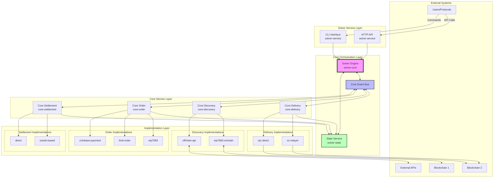
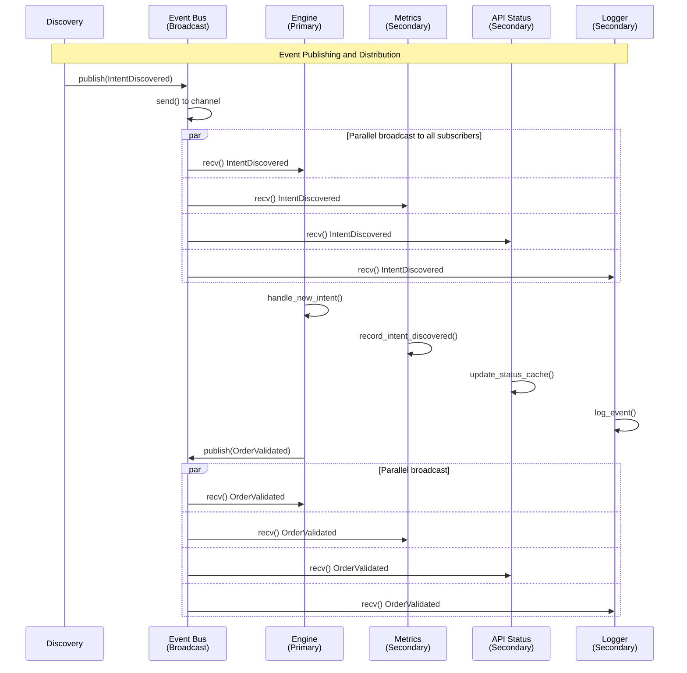
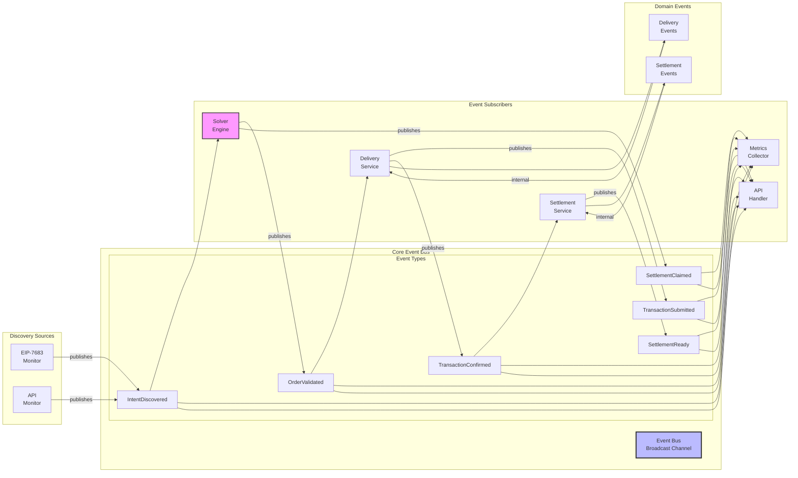

# OIF Solver Refactoring Implementation Guide

## Table of Contents

1. [Executive Summary](notion://www.notion.so/openzeppelin/23acbd12786080ae92acfc3030e1fb6c#executive-summary)
2. [Architecture Overview](notion://www.notion.so/openzeppelin/23acbd12786080ae92acfc3030e1fb6c#architecture-overview)
3. [Directory Structure](notion://www.notion.so/openzeppelin/23acbd12786080ae92acfc3030e1fb6c#directory-structure)
4. [Core Interfaces](notion://www.notion.so/openzeppelin/23acbd12786080ae92acfc3030e1fb6c#core-interfaces)
5. [Registry Pattern Implementation](notion://www.notion.so/openzeppelin/23acbd12786080ae92acfc3030e1fb6c#registry-pattern-implementation)
6. [Core Service Implementations](notion://www.notion.so/openzeppelin/23acbd12786080ae92acfc3030e1fb6c#core-service-implementations)
7. [Event Bus Architecture](notion://www.notion.so/openzeppelin/23acbd12786080ae92acfc3030e1fb6c#event-bus-architecture)
8. [Implementation Examples](notion://www.notion.so/openzeppelin/23acbd12786080ae92acfc3030e1fb6c#implementation-examples)
9. [Configuration](notion://www.notion.so/openzeppelin/23acbd12786080ae92acfc3030e1fb6c#configuration)
10. [Migration Steps](notion://www.notion.so/openzeppelin/23acbd12786080ae92acfc3030e1fb6c#migration-steps)
11. [Testing Strategy](notion://www.notion.so/openzeppelin/23acbd12786080ae92acfc3030e1fb6c#testing-strategy)

## Executive Summary

This guide details the refactoring of the OIF Solver from a generic plugin-based architecture to a cleaner domain-based architecture as proposed by Jonathan. The key changes are:

- **Remove generic plugin abstraction** - Replace with domain-specific implementations
- **Group by function, not by abstraction** - `delivery/`, `discovery/`, `order/`, `settlement/` folders
- **Protocol-agnostic core services** - Services know nothing about specific implementations
- **Registry pattern for loading** - Clean separation between orchestration and implementation
- **Two-layer event system** - Core events for orchestration, domain events for internal logic

## Architecture Overview

### High-Level Component Architecture






## Directory Structure

Create the following directory structure:

```
oif-solver/
├── crates/
│   ├── solver-core/          # Main orchestration engine
│   ├── solver-types/         # Shared types and interfaces
│   ├── solver-config/        # Configuration management
│   ├── solver-storage/       # storage management service
│   ├── solver-service/       # HTTP API and CLI
│   │
│   ├── core-delivery/        # Delivery orchestration logic
│   ├── core-discovery/       # Discovery orchestration logic
│   ├── core-settlement/      # Settlement orchestration logic
│   ├── core-order/           # Order processing orchestration
│   │
│   ├── delivery/             # Delivery implementations
│   │   ├── oz-relayer/       # OpenZeppelin relayer
│   │   ├── rpc-direct/       # Direct RPC submission
│   │   └── README.md         # How to add new delivery methods
│   │
│   ├── discovery/            # Discovery implementations
│   │   ├── eip7683-onchain/  # EIP-7683 on-chain discovery
│   │   ├── offchain-api/     # Off-chain API discovery
│   │   └── README.md         # How to add new discovery sources
│   │
│   ├── order/                # Order type implementations
│   │   ├── eip7683/          # EIP-7683 order processing
│   │   ├── limit-order/      # Limit order processing
│   │   ├── coinbase-payment/ # Coinbase payment orders
│   │   └── README.md         # How to add new order types
│   │
│   └── settlement/           # Settlement implementations
│       ├── direct/           # Direct settlement
│       ├── oracle-based/     # Oracle-based settlement
│       └── README.md         # How to add new settlement methods
│
├── config/
│   └── solver.toml           # Example configuration
│
├── scripts/
│   └── demo/                 # Demo scripts
│
├── Cargo.toml                # Workspace configuration
└── README.md                 # Project documentation
```

## Core Interfaces

### 1. Create Base Error Types

**File: `crates/solver-types/src/error.rs`**

```rust
use thiserror::Error;

#[derive(Debug, Error)]
pub enum Error {
    #[error("Unknown implementation type {0}: {1}")]
    UnknownImplementation(&'static str, String),

    #[error("Missing configuration field: {0}")]
    MissingConfig(&'static str),

    #[error("Invalid configuration: {0}")]
    InvalidConfig(String),

    #[error("Network error: {0}")]
    Network(String),

    #[error("No providers configured")]
    NoProvidersConfigured,

    #[error("Service error: {0}")]
    Service(String),
}

```

### 2. Delivery Interface

**File: `crates/solver-types/src/delivery.rs`**

```rust
use async_trait::async_trait;
use ethers::types::{Transaction, TransactionReceipt, H256, U256};
use serde::{Deserialize, Serialize};

#[async_trait]
pub trait DeliveryInterface: Send + Sync {
    /// Unique identifier for this delivery method
    fn name(&self) -> &str;

    /// Chain ID this delivery method supports
    fn chain_id(&self) -> u64;

    /// Check if this delivery method can handle the transaction
    async fn can_deliver(&self, tx: &Transaction) -> bool;

    /// Submit a transaction and return its hash
    async fn deliver(&self, tx: Transaction) -> Result<H256, DeliveryError>;

    /// Get transaction status
    async fn get_status(&self, tx_hash: H256) -> Result<TransactionStatus, DeliveryError>;

    /// Wait for transaction confirmation
    async fn wait_for_confirmation(
        &self,
        tx_hash: H256,
        confirmations: u64
    ) -> Result<TransactionReceipt, DeliveryError>;
}

#[derive(Debug, Clone, Serialize, Deserialize)]
pub enum TransactionStatus {
    Pending,
    Confirmed(u64), // block number
    Failed(String),
}

#[derive(Debug, thiserror::Error)]
pub enum DeliveryError {
    #[error("Network error: {0}")]
    Network(String),
    #[error("Transaction failed: {0}")]
    TransactionFailed(String),
    #[error("Unsupported chain: {0}")]
    UnsupportedChain(u64),
    #[error("No provider available")]
    NoProviderAvailable,
}

#[derive(Debug, Clone, Serialize, Deserialize)]
pub enum DeliveryStrategy {
    FirstAvailable,
    RoundRobin { current: usize },
}

```

### 3. Discovery Interface

**File: `crates/solver-types/src/discovery.rs`**

```rust
use async_trait::async_trait;
use tokio::sync::mpsc;
use serde::{Deserialize, Serialize};

#[async_trait]
pub trait DiscoveryInterface: Send + Sync {
    /// Unique identifier for this discovery source
    fn name(&self) -> &str;

    /// Chain ID this discovery monitors (None for off-chain)
    fn chain_id(&self) -> Option<u64>;

    /// Start monitoring for new intents
    async fn start_monitoring(
        &self,
        sender: mpsc::UnboundedSender<IntentDiscovered>
    ) -> Result<(), DiscoveryError>;

    /// Stop monitoring
    async fn stop_monitoring(&self) -> Result<(), DiscoveryError>;

    /// Health check
    async fn health_check(&self) -> Result<HealthStatus, DiscoveryError>;
}

#[derive(Debug, Clone, Serialize, Deserialize)]
pub struct IntentDiscovered {
    pub id: String,
    pub source: String,
    pub order_type: String,
    pub data: serde_json::Value,
    pub timestamp: u64,
}

#[derive(Debug, Clone, Serialize, Deserialize)]
pub struct HealthStatus {
    pub is_healthy: bool,
    pub last_block: Option<u64>,
    pub error: Option<String>,
}

#[derive(Debug, thiserror::Error)]
pub enum DiscoveryError {
    #[error("Connection error: {0}")]
    Connection(String),
    #[error("Parse error: {0}")]
    ParseError(String),
    #[error("Already monitoring")]
    AlreadyMonitoring,
}

```

### 4. Order Interface

**File: `crates/solver-types/src/order.rs`**

```rust
use async_trait::async_trait;
use ethers::types::{Transaction, Address, U256, H256};
use serde::{Deserialize, Serialize};

#[async_trait]
pub trait OrderInterface: Send + Sync {
    /// Order type identifier
    fn order_type(&self) -> &str;

    /// Parse raw order data into structured format
    fn parse_order(&self, data: &serde_json::Value) -> Result<Order, OrderError>;

    /// Validate order parameters
    async fn validate_order(&self, order: &Order) -> Result<(), OrderError>;

    /// Generate fill transaction
    async fn generate_fill_transaction(
        &self,
        order: &Order,
        solver_address: Address
    ) -> Result<Transaction, OrderError>;

    /// Generate claim/settlement transaction
    async fn generate_claim_transaction(
        &self,
        order: &Order,
        fill_tx_hash: H256
    ) -> Result<Transaction, OrderError>;

    /// Calculate profitability
    async fn calculate_profit(&self, order: &Order) -> Result<U256, OrderError>;
}

#[derive(Debug, Clone, Serialize, Deserialize)]
pub struct Order {
    pub id: String,
    pub order_type: String,
    pub source_chain: u64,
    pub dest_chain: u64,
    pub user: Address,
    pub input_token: Address,
    pub output_token: Address,
    pub input_amount: U256,
    pub output_amount: U256,
    pub deadline: u64,
    pub metadata: serde_json::Value,
}

#[derive(Debug, Clone)]
pub struct ProcessedOrder {
    pub order: Order,
    pub processor: String,
    pub expected_profit: U256,
}

#[derive(Debug, thiserror::Error)]
pub enum OrderError {
    #[error("Parse error: {0}")]
    ParseError(String),
    #[error("Validation failed: {0}")]
    ValidationFailed(String),
    #[error("Unsupported order type: {0}")]
    UnsupportedOrderType(String),
    #[error("Order expired")]
    Expired,
    #[error("Unprofitable")]
    Unprofitable,
}

```

### 5. Settlement Interface

**File: `crates/solver-types/src/settlement.rs`**

```rust
use async_trait::async_trait;
use ethers::types::H256;
use serde::{Deserialize, Serialize};
use crate::order::Order;

#[async_trait]
pub trait SettlementInterface: Send + Sync {
    /// Settlement method name
    fn name(&self) -> &str;

    /// Check if this settlement method can handle the order
    fn can_handle(&self, order: &Order) -> bool;

    /// Verify settlement conditions are met
    async fn verify_conditions(
        &self,
        order: &Order,
        fill_tx_hash: H256
    ) -> Result<bool, SettlementError>;

    /// Check oracle attestation (if applicable)
    async fn check_attestation(
        &self,
        order: &Order,
        fill_tx_hash: H256
    ) -> Result<AttestationStatus, SettlementError>;

    /// Get claim window timing
    fn get_claim_window(&self, order: &Order) -> (u64, u64);

    /// Handle disputes if any
    async fn handle_dispute(
        &self,
        order: &Order,
        dispute_data: &[u8]
    ) -> Result<DisputeResult, SettlementError>;
}

#[derive(Debug, Clone, Serialize, Deserialize)]
pub enum AttestationStatus {
    Ready(Vec<u8>),
    Pending,
    NotRequired,
}

#[derive(Debug, Clone, Serialize, Deserialize)]
pub enum DisputeResult {
    Resolved,
    Escalated,
    Lost,
}

#[derive(Debug, thiserror::Error)]
pub enum SettlementError {
    #[error("Attestation error: {0}")]
    Attestation(String),
    #[error("Claim window expired")]
    ClaimWindowExpired,
    #[error("Dispute raised")]
    Disputed,
}

```

## Registry Pattern Implementation

### 1. Registry Core

**File: `crates/solver-types/src/registry.rs`**

```rust
use async_trait::async_trait;
use std::collections::HashMap;
use std::sync::Arc;
use crate::{Error, delivery::*, discovery::*, order::*, settlement::*};

/// Registry that knows how to create implementations from configuration
pub struct ImplementationRegistry {
    delivery_factories: HashMap<String, Arc<dyn DeliveryFactory>>,
    discovery_factories: HashMap<String, Arc<dyn DiscoveryFactory>>,
    order_factories: HashMap<String, Arc<dyn OrderFactory>>,
    settlement_factories: HashMap<String, Arc<dyn SettlementFactory>>,
}

#[async_trait]
pub trait DeliveryFactory: Send + Sync {
    async fn create(&self, config: &toml::Value) -> Result<Box<dyn DeliveryInterface>, Error>;
    fn validate_config(&self, config: &toml::Value) -> Result<(), Error>;
}

#[async_trait]
pub trait DiscoveryFactory: Send + Sync {
    async fn create(&self, config: &toml::Value) -> Result<Box<dyn DiscoveryInterface>, Error>;
    fn validate_config(&self, config: &toml::Value) -> Result<(), Error>;
}

#[async_trait]
pub trait OrderFactory: Send + Sync {
    async fn create(&self, config: &toml::Value) -> Result<Box<dyn OrderInterface>, Error>;
    fn validate_config(&self, config: &toml::Value) -> Result<(), Error>;
}

#[async_trait]
pub trait SettlementFactory: Send + Sync {
    async fn create(&self, config: &toml::Value) -> Result<Box<dyn SettlementInterface>, Error>;
    fn validate_config(&self, config: &toml::Value) -> Result<(), Error>;
}

#[derive(Debug, Clone)]
pub struct AvailableImplementations {
    pub delivery: Vec<String>,
    pub discovery: Vec<String>,
    pub order: Vec<String>,
    pub settlement: Vec<String>,
}

impl ImplementationRegistry {
    pub fn new() -> Self {
        Self {
            delivery_factories: HashMap::new(),
            discovery_factories: HashMap::new(),
            order_factories: HashMap::new(),
            settlement_factories: HashMap::new(),
        }
    }

    pub fn register_delivery(&mut self, name: &str, factory: Arc<dyn DeliveryFactory>) {
        self.delivery_factories.insert(name.to_string(), factory);
    }

    pub fn register_discovery(&mut self, name: &str, factory: Arc<dyn DiscoveryFactory>) {
        self.discovery_factories.insert(name.to_string(), factory);
    }

    pub fn register_order(&mut self, name: &str, factory: Arc<dyn OrderFactory>) {
        self.order_factories.insert(name.to_string(), factory);
    }

    pub fn register_settlement(&mut self, name: &str, factory: Arc<dyn SettlementFactory>) {
        self.settlement_factories.insert(name.to_string(), factory);
    }

    pub async fn create_delivery(
        &self,
        name: &str,
        config: &toml::Value
    ) -> Result<Box<dyn DeliveryInterface>, Error> {
        let factory = self.delivery_factories
            .get(name)
            .ok_or_else(|| Error::UnknownImplementation("delivery", name.to_string()))?;

        factory.validate_config(config)?;
        factory.create(config).await
    }

    pub async fn create_discovery(
        &self,
        name: &str,
        config: &toml::Value
    ) -> Result<Box<dyn DiscoveryInterface>, Error> {
        let factory = self.discovery_factories
            .get(name)
            .ok_or_else(|| Error::UnknownImplementation("discovery", name.to_string()))?;

        factory.validate_config(config)?;
        factory.create(config).await
    }

    pub async fn create_order(
        &self,
        name: &str,
        config: &toml::Value
    ) -> Result<Box<dyn OrderInterface>, Error> {
        let factory = self.order_factories
            .get(name)
            .ok_or_else(|| Error::UnknownImplementation("order", name.to_string()))?;

        factory.validate_config(config)?;
        factory.create(config).await
    }

    pub async fn create_settlement(
        &self,
        name: &str,
        config: &toml::Value
    ) -> Result<Box<dyn SettlementInterface>, Error> {
        let factory = self.settlement_factories
            .get(name)
            .ok_or_else(|| Error::UnknownImplementation("settlement", name.to_string()))?;

        factory.validate_config(config)?;
        factory.create(config).await
    }

    pub fn list_available(&self) -> AvailableImplementations {
        AvailableImplementations {
            delivery: self.delivery_factories.keys().cloned().collect(),
            discovery: self.discovery_factories.keys().cloned().collect(),
            order: self.order_factories.keys().cloned().collect(),
            settlement: self.settlement_factories.keys().cloned().collect(),
        }
    }
}

```

## Core Service Implementations

### 1. Core Delivery Service

**File: `crates/core-delivery/src/lib.rs`**

```rust
use std::collections::HashMap;
use std::sync::Arc;
use solver_types::{delivery::*, registry::ImplementationRegistry, Error};
use solver_config::DeliveryConfig;
use tokio::sync::RwLock;

pub struct DeliveryService {
    providers: HashMap<String, Box<dyn DeliveryInterface>>,
    strategy: DeliveryStrategy,
    metrics: DeliveryMetrics,
    round_robin_state: Arc<RwLock<usize>>,
}

pub struct DeliveryServiceBuilder {
    registry: Arc<ImplementationRegistry>,
    config: DeliveryConfig,
}

impl DeliveryServiceBuilder {
    pub fn new(registry: Arc<ImplementationRegistry>, config: DeliveryConfig) -> Self {
        Self { registry, config }
    }

    pub async fn build(self) -> Result<DeliveryService, Error> {
        let mut providers = HashMap::new();

        // Load all configured providers from registry
        for (name, provider_config) in &self.config.providers {
            match self.registry.create_delivery(name, provider_config).await {
                Ok(provider) => {
                    log::info!("Loaded delivery provider: {}", name);
                    providers.insert(name.clone(), provider);
                }
                Err(e) => {
                    if self.config.require_all_providers {
                        return Err(e);
                    } else {
                        log::warn!("Failed to load provider {}: {}", name, e);
                    }
                }
            }
        }

        if providers.is_empty() {
            return Err(Error::NoProvidersConfigured);
        }

        Ok(DeliveryService {
            providers,
            strategy: self.config.strategy,
            metrics: DeliveryMetrics::new(),
            round_robin_state: Arc::new(RwLock::new(0)),
        })
    }
}

impl DeliveryService {
    pub async fn deliver(&self, tx: Transaction) -> Result<H256, DeliveryError> {
        let provider = self.select_provider(&tx).await?;

        let start = std::time::Instant::now();
        let result = provider.deliver(tx).await;

        self.metrics.record_delivery(
            provider.name(),
            start.elapsed(),
            result.is_ok()
        );

        result
    }

    pub async fn wait_for_confirmation(
        &self,
        tx_hash: H256,
        chain_id: u64,
        confirmations: u64
    ) -> Result<TransactionReceipt, DeliveryError> {
        // Find provider for chain
        let provider = self.providers.values()
            .find(|p| p.chain_id() == chain_id)
            .ok_or(DeliveryError::UnsupportedChain(chain_id))?;

        provider.wait_for_confirmation(tx_hash, confirmations).await
    }

    async fn select_provider(&self, tx: &Transaction) -> Result<&dyn DeliveryInterface, DeliveryError> {
        match &self.strategy {
            DeliveryStrategy::FirstAvailable => {
                for provider in self.providers.values() {
                    if provider.can_deliver(tx).await {
                        return Ok(provider.as_ref());
                    }
                }
                Err(DeliveryError::NoProviderAvailable)
            }

            DeliveryStrategy::RoundRobin { .. } => {
                let providers: Vec<_> = self.providers.values().collect();
                let mut current = self.round_robin_state.write().await;

                let start = *current;
                loop {
                    let provider = &providers[*current % providers.len()];
                    *current = (*current + 1) % providers.len();

                    if provider.can_deliver(tx).await {
                        return Ok(provider.as_ref());
                    }

                    if *current == start {
                        break;
                    }
                }

                Err(DeliveryError::NoProviderAvailable)
            }

            DeliveryStrategy::Fallback { primary, fallback } => {
                if let Some(provider) = self.providers.get(primary) {
                    if provider.can_deliver(tx).await {
                        return Ok(provider.as_ref());
                    }
                }

                if let Some(provider) = self.providers.get(fallback) {
                    if provider.can_deliver(tx).await {
                        return Ok(provider.as_ref());
                    }
                }

                Err(DeliveryError::NoProviderAvailable)
            }

            DeliveryStrategy::CostOptimized => {
                // TODO: Implement cost optimization logic
                self.select_provider(&tx).await
            }
        }
    }
}

struct DeliveryMetrics {
    // Implementation details for metrics collection
}

impl DeliveryMetrics {
    fn new() -> Self {
        Self {}
    }

    fn record_delivery(&self, provider: &str, duration: std::time::Duration, success: bool) {
        // Record metrics
    }
}

```

### 2. Core Discovery Service

**File: `crates/core-discovery/src/lib.rs`**

```rust
use std::collections::HashMap;
use std::sync::Arc;
use solver_types::{discovery::*, registry::ImplementationRegistry, Error};
use solver_config::DiscoveryConfig;
use tokio::sync::mpsc;
use tokio::task::JoinHandle;

pub struct DiscoveryService {
    sources: HashMap<String, Box<dyn DiscoveryInterface>>,
    event_sender: mpsc::UnboundedSender<IntentDiscovered>,
    monitoring_tasks: HashMap<String, JoinHandle<()>>,
}

pub struct DiscoveryServiceBuilder {
    registry: Arc<ImplementationRegistry>,
    config: DiscoveryConfig,
    event_sender: Option<mpsc::UnboundedSender<IntentDiscovered>>,
}

impl DiscoveryServiceBuilder {
    pub fn new(registry: Arc<ImplementationRegistry>, config: DiscoveryConfig) -> Self {
        Self {
            registry,
            config,
            event_sender: None,
        }
    }

    pub fn with_event_sender(mut self, sender: mpsc::UnboundedSender<IntentDiscovered>) -> Self {
        self.event_sender = Some(sender);
        self
    }

    pub async fn build(self) -> Result<DiscoveryService, Error> {
        let event_sender = self.event_sender
            .ok_or_else(|| Error::Service("Event sender not provided".into()))?;

        let mut sources = HashMap::new();

        // Load enabled discovery sources
        for source_name in &self.config.enabled_sources {
            let source_config = self.config.sources
                .get(source_name)
                .ok_or_else(|| Error::MissingConfig(source_name))?;

            match self.registry.create_discovery(source_name, source_config).await {
                Ok(source) => {
                    log::info!("Loaded discovery source: {}", source_name);
                    sources.insert(source_name.clone(), source);
                }
                Err(e) => {
                    log::error!("Failed to load discovery source {}: {}", source_name, e);
                    if self.config.require_all_sources {
                        return Err(e);
                    }
                }
            }
        }

        if sources.is_empty() {
            return Err(Error::Service("No discovery sources loaded".into()));
        }

        Ok(DiscoveryService {
            sources,
            event_sender,
            monitoring_tasks: HashMap::new(),
        })
    }
}

impl DiscoveryService {
    pub async fn start_all(&mut self) -> Result<(), Error> {
        for (name, source) in &self.sources {
            let sender = self.event_sender.clone();
            source.start_monitoring(sender).await
                .map_err(|e| Error::Service(format!("Failed to start {}: {}", name, e)))?;

            log::info!("Started monitoring: {}", name);
        }
        Ok(())
    }

    pub async fn stop_all(&mut self) -> Result<(), Error> {
        for (name, source) in &self.sources {
            source.stop_monitoring().await
                .map_err(|e| Error::Service(format!("Failed to stop {}: {}", name, e)))?;

            log::info!("Stopped monitoring: {}", name);
        }
        Ok(())
    }

    pub async fn health_check(&self) -> HashMap<String, HealthStatus> {
        let mut results = HashMap::new();

        for (name, source) in &self.sources {
            match source.health_check().await {
                Ok(status) => {
                    results.insert(name.clone(), status);
                }
                Err(e) => {
                    results.insert(name.clone(), HealthStatus {
                        is_healthy: false,
                        last_block: None,
                        error: Some(e.to_string()),
                    });
                }
            }
        }

        results
    }
}

```

### 3. Core Order Service

**File: `crates/core-order/src/lib.rs`**

```rust
use std::collections::HashMap;
use std::sync::Arc;
use solver_types::{order::*, discovery::IntentDiscovered, registry::ImplementationRegistry, Error};
use solver_config::OrderConfig;
use solver_state::StateService;

pub struct OrderService {
    processors: HashMap<String, Box<dyn OrderInterface>>,
    state_service: Arc<StateService>,
    min_profit_threshold: U256,
}

pub struct OrderServiceBuilder {
    registry: Arc<ImplementationRegistry>,
    config: OrderConfig,
    state_service: Option<Arc<StateService>>,
}

impl OrderServiceBuilder {
    pub fn new(registry: Arc<ImplementationRegistry>, config: OrderConfig) -> Self {
        Self {
            registry,
            config,
            state_service: None,
        }
    }

    pub fn with_state(mut self, state: Arc<StateService>) -> Self {
        self.state_service = Some(state);
        self
    }

    pub async fn build(self) -> Result<OrderService, Error> {
        let state_service = self.state_service
            .ok_or_else(|| Error::Service("State service not provided".into()))?;

        let mut processors = HashMap::new();

        // Load enabled order processors
        for order_type in &self.config.enabled_types {
            let order_config = self.config.types
                .get(order_type)
                .ok_or_else(|| Error::MissingConfig(order_type))?;

            match self.registry.create_order(order_type, order_config).await {
                Ok(processor) => {
                    log::info!("Loaded order processor: {}", order_type);
                    processors.insert(order_type.clone(), processor);
                }
                Err(e) => {
                    log::error!("Failed to load order processor {}: {}", order_type, e);
                    return Err(e);
                }
            }
        }

        if processors.is_empty() {
            return Err(Error::Service("No order processors loaded".into()));
        }

        Ok(OrderService {
            processors,
            state_service,
            min_profit_threshold: self.config.min_profit_threshold,
        })
    }
}

impl OrderService {
    pub async fn process_intent(&self, intent: IntentDiscovered) -> Result<ProcessedOrder, OrderError> {
        // Extract order type from intent
        let order_type = self.extract_order_type(&intent)?;

        // Get appropriate processor
        let processor = self.processors.get(&order_type)
            .ok_or_else(|| OrderError::UnsupportedOrderType(order_type.clone()))?;

        // Parse and validate
        let order = processor.parse_order(&intent.data)?;
        processor.validate_order(&order).await?;

        // Check profitability
        let profit = processor.calculate_profit(&order).await?;
        if profit < self.min_profit_threshold {
            return Err(OrderError::Unprofitable);
        }

        // Store in state
        self.state_service.store_order(&order).await
            .map_err(|e| OrderError::ValidationFailed(e.to_string()))?;

        Ok(ProcessedOrder {
            order,
            processor: order_type,
            expected_profit: profit,
        })
    }

    pub fn get_processor(&self, order_type: &str) -> Option<&dyn OrderInterface> {
        self.processors.get(order_type).map(|p| p.as_ref())
    }

    fn extract_order_type(&self, intent: &IntentDiscovered) -> Result<String, OrderError> {
        // Extract from intent metadata
        Ok(intent.order_type.clone())
    }
}

```

### 4. Core Settlement Service

**File: `crates/core-settlement/src/lib.rs`**

```rust
use std::collections::HashMap;
use std::sync::Arc;
use std::time::Duration;
use solver_types::{settlement::*, order::Order, registry::ImplementationRegistry, Error};
use solver_config::SettlementConfig;
use tokio::sync::mpsc;
use ethers::types::H256;

pub struct SettlementService {
    methods: HashMap<String, Box<dyn SettlementInterface>>,
    event_sender: mpsc::UnboundedSender<SettlementEvent>,
    monitor_interval: Duration,
}

#[derive(Debug, Clone)]
pub enum SettlementEvent {
    ReadyToClaim { order_id: String, attestation_data: Vec<u8> },
    DisputeRaised { order_id: String, challenger: Address },
    ClaimWindowExpiring { order_id: String, expires_at: u64 },
}

pub struct SettlementServiceBuilder {
    registry: Arc<ImplementationRegistry>,
    config: SettlementConfig,
    event_sender: Option<mpsc::UnboundedSender<SettlementEvent>>,
}

impl SettlementServiceBuilder {
    pub fn new(registry: Arc<ImplementationRegistry>, config: SettlementConfig) -> Self {
        Self {
            registry,
            config,
            event_sender: None,
        }
    }

    pub fn with_event_sender(mut self, sender: mpsc::UnboundedSender<SettlementEvent>) -> Self {
        self.event_sender = Some(sender);
        self
    }

    pub async fn build(self) -> Result<SettlementService, Error> {
        let event_sender = self.event_sender
            .ok_or_else(|| Error::Service("Event sender not provided".into()))?;

        let mut methods = HashMap::new();

        // Load default settlement method
        let default_config = self.config.methods
            .get(&self.config.default_method)
            .ok_or_else(|| Error::MissingConfig(&self.config.default_method))?;

        let default_method = self.registry
            .create_settlement(&self.config.default_method, default_config)
            .await?;

        methods.insert(self.config.default_method.clone(), default_method);

        // Load fallback methods
        for method_name in &self.config.fallback_methods {
            if let Some(method_config) = self.config.methods.get(method_name) {
                match self.registry.create_settlement(method_name, method_config).await {
                    Ok(method) => {
                        methods.insert(method_name.clone(), method);
                    }
                    Err(e) => {
                        log::warn!("Failed to load fallback settlement method {}: {}", method_name, e);
                    }
                }
            }
        }

        Ok(SettlementService {
            methods,
            event_sender,
            monitor_interval: Duration::from_secs(self.config.monitor_interval_seconds),
        })
    }
}

impl SettlementService {
    pub async fn monitor_fill(&self, order: &Order, fill_tx_hash: H256) -> Result<(), Error> {
        // Find appropriate settlement method
        let method = self.find_method(order)?;

        // Create internal channel for monitoring task
        let (internal_tx, mut internal_rx) = mpsc::channel(10);

        // Clone needed data for the monitoring task
        let order = order.clone();
        let method_name = method.name().to_string();
        let event_sender = self.event_sender.clone();
        let monitor_interval = self.monitor_interval;

        // Spawn monitoring task
        tokio::spawn(async move {
            let mut last_check = std::time::Instant::now();

            loop {
                if last_check.elapsed() >= monitor_interval {
                    // Check if conditions are met
                    match method.verify_conditions(&order, fill_tx_hash).await {
                        Ok(true) => {
                            // Check attestation
                            match method.check_attestation(&order, fill_tx_hash).await {
                                Ok(AttestationStatus::Ready(data)) => {
                                    internal_tx.send(SettlementEvent::ReadyToClaim {
                                        order_id: order.id.clone(),
                                        attestation_data: data,
                                    }).await.ok();
                                    break;
                                }
                                Ok(AttestationStatus::Pending) => {
                                    // Continue monitoring
                                }
                                Ok(AttestationStatus::NotRequired) => {
                                    internal_tx.send(SettlementEvent::ReadyToClaim {
                                        order_id: order.id.clone(),
                                        attestation_data: vec![],
                                    }).await.ok();
                                    break;
                                }
                                Err(e) => {
                                    log::error!("Attestation check failed: {}", e);
                                    break;
                                }
                            }
                        }
                        Ok(false) => {
                            // Conditions not met yet
                        }
                        Err(e) => {
                            log::error!("Condition check failed: {}", e);
                            break;
                        }
                    }

                    // Check if claim window is expiring
                    let (_, end) = method.get_claim_window(&order);
                    let now = std::time::SystemTime::now()
                        .duration_since(std::time::UNIX_EPOCH)
                        .unwrap()
                        .as_secs();

                    if now > end - 3600 { // 1 hour before expiry
                        internal_tx.send(SettlementEvent::ClaimWindowExpiring {
                            order_id: order.id.clone(),
                            expires_at: end,
                        }).await.ok();
                    }

                    last_check = std::time::Instant::now();
                }

                tokio::time::sleep(Duration::from_secs(1)).await;
            }
        });

        // Forward internal events to main event bus
        let event_sender = self.event_sender.clone();
        tokio::spawn(async move {
            while let Some(event) = internal_rx.recv().await {
                event_sender.send(event).await.ok();
            }
        });

        Ok(())
    }

    fn find_method(&self, order: &Order) -> Result<&dyn SettlementInterface, Error> {
        // Try to find a method that can handle this order
        for method in self.methods.values() {
            if method.can_handle(order) {
                return Ok(method.as_ref());
            }
        }

        Err(Error::Service(format!("No settlement method for order type: {}", order.order_type)))
    }
}

```

## Event Bus Architecture

### Event Bus Implementation

**File: `crates/solver-core/src/event_bus.rs`**

```rust
use tokio::sync::{broadcast, mpsc};
use std::sync::Arc;
use solver_types::{discovery::IntentDiscovered, order::Order};
use ethers::types::{H256, TransactionReceipt, Address};

#[derive(Debug, Clone)]
pub enum CoreEvent {
    // Discovery events
    IntentDiscovered(IntentDiscovered),

    // Order processing events
    OrderValidated { order_id: String, order: Order },
    OrderRejected { order_id: String, reason: String },

    // Delivery events
    TransactionSubmitted { order_id: String, tx_hash: H256 },
    TransactionConfirmed { order_id: String, receipt: TransactionReceipt },
    TransactionFailed { order_id: String, error: String },

    // Settlement events
    SettlementReady { order_id: String, claim_data: Vec<u8> },
    SettlementClaimed { order_id: String, claim_tx: H256 },

    // System events
    ServiceHealthUpdate { service: String, status: serde_json::Value },
}

pub struct EventBus {
    sender: broadcast::Sender<CoreEvent>,
    receiver: broadcast::Receiver<CoreEvent>,
}

impl EventBus {
    pub fn new() -> Self {
        let (sender, receiver) = broadcast::channel(1000);
        Self { sender, receiver }
    }

    pub fn subscribe(&self) -> broadcast::Receiver<CoreEvent> {
        self.sender.subscribe()
    }

    pub async fn publish(&self, event: CoreEvent) {
        match self.sender.send(event) {
            Ok(num_receivers) => {
                log::debug!("Event published to {} receivers", num_receivers);
            }
            Err(e) => {
                log::error!("Failed to publish event: {}", e);
            }
        }
    }
}

```

### Event Flow Diagram



## Implementation Examples

### 1. RPC Direct Delivery Implementation

**File: `crates/delivery/rpc-direct/src/lib.rs`**

```rust
use async_trait::async_trait;
use ethers::{
    providers::{Provider, Http, Middleware},
    signers::{LocalWallet, Signer},
    types::{Transaction, TransactionReceipt, H256, U256},
};
use solver_types::{delivery::*, registry::*, Error};
use std::sync::Arc;

pub struct RpcDirectDelivery {
    provider: Arc<Provider<Http>>,
    chain_id: u64,
    signer: LocalWallet,
    name: String,
}

#[async_trait]
impl DeliveryInterface for RpcDirectDelivery {
    fn name(&self) -> &str {
        &self.name
    }

    fn chain_id(&self) -> u64 {
        self.chain_id
    }

    async fn can_deliver(&self, tx: &Transaction) -> bool {
        // Check if we have sufficient balance for gas
        let balance = match self.provider
            .get_balance(self.signer.address(), None)
            .await
        {
            Ok(bal) => bal,
            Err(_) => return false,
        };

        let required = tx.gas_price.unwrap_or_default() * tx.gas.unwrap_or_default() + tx.value.unwrap_or_default();
        balance >= required
    }

    async fn deliver(&self, mut tx: Transaction) -> Result<H256, DeliveryError> {
        // Set from address
        tx.from = Some(self.signer.address());

        // Get nonce if not set
        if tx.nonce.is_none() {
            tx.nonce = Some(
                self.provider
                    .get_transaction_count(self.signer.address(), None)
                    .await
                    .map_err(|e| DeliveryError::Network(e.to_string()))?
            );
        }

        // Estimate gas if not set
        if tx.gas.is_none() {
            tx.gas = Some(
                self.provider
                    .estimate_gas(&tx, None)
                    .await
                    .map_err(|e| DeliveryError::Network(e.to_string()))?
            );
        }

        // Get gas price if not set
        if tx.gas_price.is_none() {
            tx.gas_price = Some(
                self.provider
                    .get_gas_price()
                    .await
                    .map_err(|e| DeliveryError::Network(e.to_string()))?
            );
        }

        // Sign transaction
        let signature = self.signer
            .sign_transaction(&tx)
            .await
            .map_err(|e| DeliveryError::Network(e.to_string()))?;

        // Send transaction
        let raw_tx = tx.rlp_signed(&signature);
        let pending_tx = self.provider
            .send_raw_transaction(raw_tx)
            .await
            .map_err(|e| DeliveryError::Network(e.to_string()))?;

        Ok(pending_tx.tx_hash())
    }

    async fn get_status(&self, tx_hash: H256) -> Result<TransactionStatus, DeliveryError> {
        match self.provider.get_transaction_receipt(tx_hash).await {
            Ok(Some(receipt)) => {
                if receipt.status == Some(1.into()) {
                    Ok(TransactionStatus::Confirmed(receipt.block_number.unwrap().as_u64()))
                } else {
                    Ok(TransactionStatus::Failed("Transaction reverted".to_string()))
                }
            }
            Ok(None) => Ok(TransactionStatus::Pending),
            Err(e) => Err(DeliveryError::Network(e.to_string())),
        }
    }

    async fn wait_for_confirmation(
        &self,
        tx_hash: H256,
        confirmations: u64
    ) -> Result<TransactionReceipt, DeliveryError> {
        let receipt = self.provider
            .pending_transaction(tx_hash)
            .confirmations(confirmations as usize)
            .await
            .map_err(|e| DeliveryError::Network(e.to_string()))?
            .ok_or_else(|| DeliveryError::TransactionFailed("Transaction not found".to_string()))?;

        if receipt.status != Some(1.into()) {
            return Err(DeliveryError::TransactionFailed("Transaction reverted".to_string()));
        }

        Ok(receipt)
    }
}

// Factory implementation
pub struct RpcDirectFactory;

#[async_trait]
impl DeliveryFactory for RpcDirectFactory {
    async fn create(&self, config: &toml::Value) -> Result<Box<dyn DeliveryInterface>, Error> {
        let rpc_url = config
            .get("rpc_url")
            .and_then(|v| v.as_str())
            .ok_or_else(|| Error::MissingConfig("rpc_url"))?;

        let private_key = config
            .get("private_key")
            .and_then(|v| v.as_str())
            .ok_or_else(|| Error::MissingConfig("private_key"))?;

        let chain_id = config
            .get("chain_id")
            .and_then(|v| v.as_integer())
            .ok_or_else(|| Error::MissingConfig("chain_id"))? as u64;

        let provider = Provider::<Http>::try_from(rpc_url)
            .map_err(|e| Error::InvalidConfig(format!("Invalid RPC URL: {}", e)))?;

        let signer = private_key
            .parse::<LocalWallet>()
            .map_err(|e| Error::InvalidConfig(format!("Invalid private key: {}", e)))?
            .with_chain_id(chain_id);

        Ok(Box::new(RpcDirectDelivery {
            provider: Arc::new(provider),
            chain_id,
            signer,
            name: format!("rpc-direct-{}", chain_id),
        }))
    }

    fn validate_config(&self, config: &toml::Value) -> Result<(), Error> {
        if !config.get("rpc_url").is_some() {
            return Err(Error::MissingConfig("rpc_url"));
        }
        if !config.get("private_key").is_some() {
            return Err(Error::MissingConfig("private_key"));
        }
        if !config.get("chain_id").is_some() {
            return Err(Error::MissingConfig("chain_id"));
        }
        Ok(())
    }
}

// Registration function
pub fn register(registry: &mut ImplementationRegistry) {
    registry.register_delivery("rpc-direct", Arc::new(RpcDirectFactory));
}

```

### 2. EIP-7683 Order Processor Implementation

**File: `crates/order/eip7683/src/lib.rs`**

```rust
use async_trait::async_trait;
use ethers::{
    abi::{Abi, encode},
    types::{Transaction, Address, U256, H256},
};
use solver_types::{order::*, registry::*, Error};
use serde::{Deserialize, Serialize};
use std::sync::Arc;

#[derive(Debug, Clone, Serialize, Deserialize)]
pub struct Eip7683OrderData {
    pub id: String,
    pub swapper: Address,
    pub origin_chain_id: u64,
    pub dest_chain_id: u64,
    pub input_token: Address,
    pub output_token: Address,
    pub max_input: U256,
    pub min_output: U256,
    pub deadline: u64,
    pub nonce: U256,
}

pub struct Eip7683OrderProcessor {
    input_settler_address: Address,
    output_settler_address: Address,
    input_settler_abi: Abi,
    output_settler_abi: Abi,
}

#[async_trait]
impl OrderInterface for Eip7683OrderProcessor {
    fn order_type(&self) -> &str {
        "eip7683"
    }

    fn parse_order(&self, data: &serde_json::Value) -> Result<Order, OrderError> {
        let order_data: Eip7683OrderData = serde_json::from_value(data.clone())
            .map_err(|e| OrderError::ParseError(e.to_string()))?;

        Ok(Order {
            id: order_data.id,
            order_type: "eip7683".to_string(),
            source_chain: order_data.origin_chain_id,
            dest_chain: order_data.dest_chain_id,
            user: order_data.swapper,
            input_token: order_data.input_token,
            output_token: order_data.output_token,
            input_amount: order_data.max_input,
            output_amount: order_data.min_output,
            deadline: order_data.deadline,
            metadata: data.clone(),
        })
    }

    async fn validate_order(&self, order: &Order) -> Result<(), OrderError> {
        // Check deadline
        let now = std::time::SystemTime::now()
            .duration_since(std::time::UNIX_EPOCH)
            .unwrap()
            .as_secs();

        if order.deadline <= now {
            return Err(OrderError::Expired);
        }

        // Validate amounts
        if order.input_amount == U256::zero() || order.output_amount == U256::zero() {
            return Err(OrderError::ValidationFailed("Invalid amounts".to_string()));
        }

        // TODO: Additional validation (token whitelist, etc.)

        Ok(())
    }

    async fn generate_fill_transaction(
        &self,
        order: &Order,
        solver_address: Address
    ) -> Result<Transaction, OrderError> {
        // Generate fill transaction for OutputSettler
        let function = self.output_settler_abi
            .function("fill")
            .map_err(|e| OrderError::ValidationFailed(e.to_string()))?;

        let fill_data = function
            .encode_input(&[
                ethers::abi::Token::String(order.id.clone()),
                ethers::abi::Token::Address(order.user),
                ethers::abi::Token::Address(order.output_token),
                ethers::abi::Token::Uint(order.output_amount),
            ])
            .map_err(|e| OrderError::ValidationFailed(e.to_string()))?;

        Ok(Transaction {
            to: Some(self.output_settler_address),
            data: Some(fill_data.into()),
            value: Some(U256::zero()),
            gas: Some(300000.into()), // Estimate
            ..Default::default()
        })
    }

    async fn generate_claim_transaction(
        &self,
        order: &Order,
        fill_tx_hash: H256
    ) -> Result<Transaction, OrderError> {
        // Generate claim transaction for InputSettler
        let function = self.input_settler_abi
            .function("claim")
            .map_err(|e| OrderError::ValidationFailed(e.to_string()))?;

        let claim_data = function
            .encode_input(&[
                ethers::abi::Token::String(order.id.clone()),
                ethers::abi::Token::FixedBytes(fill_tx_hash.as_bytes().to_vec()),
            ])
            .map_err(|e| OrderError::ValidationFailed(e.to_string()))?;

        Ok(Transaction {
            to: Some(self.input_settler_address),
            data: Some(claim_data.into()),
            value: Some(U256::zero()),
            gas: Some(200000.into()), // Estimate
            ..Default::default()
        })
    }

    async fn calculate_profit(&self, order: &Order) -> Result<U256, OrderError> {
        // Simple profit calculation
        // TODO: Implement proper price oracle integration

        // For now, assume 1:1 exchange rate and calculate based on amounts
        if order.input_amount > order.output_amount {
            Ok(order.input_amount - order.output_amount)
        } else {
            Ok(U256::zero())
        }
    }
}

// Factory implementation
pub struct Eip7683Factory;

#[async_trait]
impl OrderFactory for Eip7683Factory {
    async fn create(&self, config: &toml::Value) -> Result<Box<dyn OrderInterface>, Error> {
        let input_settler_address = config
            .get("input_settler_address")
            .and_then(|v| v.as_str())
            .and_then(|s| s.parse::<Address>().ok())
            .ok_or_else(|| Error::MissingConfig("input_settler_address"))?;

        let output_settler_address = config
            .get("output_settler_address")
            .and_then(|v| v.as_str())
            .and_then(|s| s.parse::<Address>().ok())
            .ok_or_else(|| Error::MissingConfig("output_settler_address"))?;

        // Load ABIs (simplified - in reality would load from files)
        let input_settler_abi = serde_json::from_str(INPUT_SETTLER_ABI)
            .map_err(|e| Error::InvalidConfig(format!("Invalid ABI: {}", e)))?;

        let output_settler_abi = serde_json::from_str(OUTPUT_SETTLER_ABI)
            .map_err(|e| Error::InvalidConfig(format!("Invalid ABI: {}", e)))?;

        Ok(Box::new(Eip7683OrderProcessor {
            input_settler_address,
            output_settler_address,
            input_settler_abi,
            output_settler_abi,
        }))
    }

    fn validate_config(&self, config: &toml::Value) -> Result<(), Error> {
        if !config.get("input_settler_address").is_some() {
            return Err(Error::MissingConfig("input_settler_address"));
        }
        if !config.get("output_settler_address").is_some() {
            return Err(Error::MissingConfig("output_settler_address"));
        }
        Ok(())
    }
}

// Registration function
pub fn register(registry: &mut ImplementationRegistry) {
    registry.register_order("eip7683", Arc::new(Eip7683Factory));
}

// ABI constants (simplified)
const INPUT_SETTLER_ABI: &str = r#"[]"#;
const OUTPUT_SETTLER_ABI: &str = r#"[]"#;

```

## Main Solver Engine

**File: `crates/solver-core/src/engine.rs`**

```rust
use std::sync::Arc;
use tokio::sync::mpsc;
use solver_types::{
    registry::ImplementationRegistry,
    discovery::IntentDiscovered,
    order::ProcessedOrder,
    Error,
};
use solver_config::Config;
use solver_state::StateService;
use crate::event_bus::{EventBus, CoreEvent};

pub struct SolverEngine {
    delivery: DeliveryService,
    discovery: DiscoveryService,
    order_service: OrderService,
    settlement: SettlementService,
    state: Arc<StateService>,
    event_bus: EventBus,
    solver_address: Address,
}

impl SolverEngine {
    pub async fn from_config(
        config: Config,
        registry: Arc<ImplementationRegistry>
    ) -> Result<Self, Error> {
        // Initialize state service
        let state = Arc::new(StateService::new(&config.state)?);

        // Create event channels
        let (discovery_tx, discovery_rx) = mpsc::unbounded_channel();
        let (settlement_tx, settlement_rx) = mpsc::unbounded_channel();

        // Build services using registry
        let delivery = DeliveryServiceBuilder::new(registry.clone(), config.delivery)
            .build()
            .await?;

        let discovery = DiscoveryServiceBuilder::new(registry.clone(), config.discovery)
            .with_event_sender(discovery_tx)
            .build()
            .await?;

        let order_service = OrderServiceBuilder::new(registry.clone(), config.order)
            .with_state(state.clone())
            .build()
            .await?;

        let settlement = SettlementServiceBuilder::new(registry.clone(), config.settlement)
            .with_event_sender(settlement_tx)
            .build()
            .await?;

        let event_bus = EventBus::new();

        // Parse solver address
        let solver_address = config.solver.address
            .parse::<Address>()
            .map_err(|e| Error::InvalidConfig(format!("Invalid solver address: {}", e)))?;

        Ok(Self {
            delivery,
            discovery,
            order_service,
            settlement,
            state,
            event_bus,
            solver_address,
        })
    }

    pub async fn run(&mut self) -> Result<(), Box<dyn std::error::Error>> {
        // Start discovery sources
        self.discovery.start_all().await?;

        // Subscribe to events
        let mut core_events = self.event_bus.subscribe();

        // Main event processing loop
        loop {
            tokio::select! {
                // Handle core events
                Ok(event) = core_events.recv() => {
                    match event {
                        CoreEvent::IntentDiscovered(intent) => {
                            self.handle_new_intent(intent).await?;
                        }
                        CoreEvent::TransactionConfirmed { order_id, receipt } => {
                            self.handle_fill_confirmed(order_id, receipt).await?;
                        }
                        CoreEvent::SettlementReady { order_id, claim_data } => {
                            self.handle_claim(order_id, claim_data).await?;
                        }
                        _ => {
                            // Handle other events
                        }
                    }
                }

                // Shutdown signal
                _ = tokio::signal::ctrl_c() => {
                    log::info!("Shutting down solver engine");
                    break;
                }
            }
        }

        // Graceful shutdown
        self.discovery.stop_all().await?;

        Ok(())
    }

    async fn handle_new_intent(
        &self,
        intent: IntentDiscovered
    ) -> Result<(), Box<dyn std::error::Error>> {
        log::info!("Processing new intent: {}", intent.id);

        // Process through order service
        let processed = match self.order_service.process_intent(intent).await {
            Ok(p) => p,
            Err(e) => {
                log::warn!("Failed to process intent: {}", e);
                self.event_bus.publish(CoreEvent::OrderRejected {
                    order_id: intent.id,
                    reason: e.to_string(),
                }).await;
                return Ok(());
            }
        };

        // Publish order validated event
        self.event_bus.publish(CoreEvent::OrderValidated {
            order_id: processed.order.id.clone(),
            order: processed.order.clone(),
        }).await;

        // Generate fill transaction
        let order_processor = self.order_service
            .get_processor(&processed.processor)
            .ok_or("Order processor not found")?;

        let fill_tx = order_processor
            .generate_fill_transaction(&processed.order, self.solver_address)
            .await?;

        // Submit through delivery service
        let tx_hash = self.delivery.deliver(fill_tx).await?;

        // Publish transaction submitted event
        self.event_bus.publish(CoreEvent::TransactionSubmitted {
            order_id: processed.order.id.clone(),
            tx_hash,
        }).await;

        // Wait for confirmation
        let receipt = self.delivery
            .wait_for_confirmation(tx_hash, processed.order.dest_chain, 1)
            .await?;

        // Publish transaction confirmed event
        self.event_bus.publish(CoreEvent::TransactionConfirmed {
            order_id: processed.order.id.clone(),
            receipt: receipt.clone(),
        }).await;

        // Start settlement monitoring
        self.settlement.monitor_fill(&processed.order, receipt.transaction_hash).await?;

        Ok(())
    }

    async fn handle_fill_confirmed(
        &self,
        order_id: String,
        receipt: TransactionReceipt
    ) -> Result<(), Box<dyn std::error::Error>> {
        log::info!("Fill confirmed for order: {}", order_id);

        // Update state
        self.state.update_order_status(&order_id, "filled").await?;

        Ok(())
    }

    async fn handle_claim(
        &self,
        order_id: String,
        claim_data: Vec<u8>
    ) -> Result<(), Box<dyn std::error::Error>> {
        log::info!("Processing claim for order: {}", order_id);

        // Get order from state
        let order = self.state.get_order(&order_id).await?
            .ok_or("Order not found")?;

        // Get order processor
        let order_processor = self.order_service
            .get_processor(&order.order_type)
            .ok_or("Order processor not found")?;

        // Generate claim transaction
        let fill_tx_hash = H256::from_slice(&claim_data[..32]); // Extract from claim data
        let claim_tx = order_processor
            .generate_claim_transaction(&order, fill_tx_hash)
            .await?;

        // Submit claim transaction
        let claim_hash = self.delivery.deliver(claim_tx).await?;

        // Publish settlement claimed event
        self.event_bus.publish(CoreEvent::SettlementClaimed {
            order_id,
            claim_tx: claim_hash,
        }).await;

        Ok(())
    }
}

```

## Configuration

**File: `config/solver.toml`**

```toml
# Solver Configuration

[solver]
address = "0x742d35Cc6634C0532925a3b844Bc9e7595f6Fed3"
min_profit_wei = "1000000000000000" # 0.001 ETH

[state]
backend = "memory"
ttl_seconds = 86400

[delivery]
strategy = "fallback"
primary = "oz-relayer"
fallback = "rpc-direct"
require_all_providers = false

[delivery.providers.oz-relayer]
api_key = "your-api-key"
endpoint = "<https://api.openzeppelin.com/relayer/v1>"

[delivery.providers.rpc-direct]
rpc_url = "<https://eth-mainnet.g.alchemy.com/v2/your-key>"
private_key = "0x..."
chain_id = 1

[discovery]
enabled_sources = ["eip7683-mainnet", "eip7683-arbitrum"]
require_all_sources = false

[discovery.sources.eip7683-mainnet]
chain_id = 1
settler_address = "0x..."
start_block = "latest"
poll_interval = 12

[discovery.sources.eip7683-arbitrum]
chain_id = 42161
settler_address = "0x..."
start_block = "latest"
poll_interval = 2

[order]
enabled_types = ["eip7683"]
min_profit_threshold = "1000000000000000"

[order.types.eip7683]
input_settler_address = "0x..."
output_settler_address = "0x..."

[settlement]
default_method = "oracle-based"
fallback_methods = ["direct"]
monitor_interval_seconds = 30

[settlement.methods.oracle-based]
oracle_address = "0x..."
attestation_delay_seconds = 300

[settlement.methods.direct]
challenge_period_seconds = 3600

```

## Migration Steps

### Phase 1: Setup New Structure (Day 1-2)

1. **Create new directory structure**

   ```bash
   mkdir -p crates/{solver-core,solver-types,solver-config,solver-state,solver-service}
   mkdir -p crates/{core-delivery,core-discovery,core-order,core-settlement}
   mkdir -p crates/delivery/{oz-relayer,rpc-direct}
   mkdir -p crates/discovery/{eip7683-onchain,offchain-api}
   mkdir -p crates/order/{eip7683,limit-order,coinbase-payment}
   mkdir -p crates/settlement/{oracle-based,direct}

   ```

2. **Create Cargo.toml for workspace**

   ```toml
   [workspace]
   members = [
       "crates/*",
       "crates/delivery/*",
       "crates/discovery/*",
       "crates/order/*",
       "crates/settlement/*",
   ]
   resolver = "2"

   ```

### Phase 2: Implement Core Types (Day 3-4)

1. Implement all interfaces in `solver-types`
2. Implement registry pattern
3. Create error types
4. Add necessary dependencies

### Phase 3: Implement Core Services (Day 5-7)

1. Implement `core-delivery`
2. Implement `core-discovery`
3. Implement `core-order`
4. Implement `core-settlement`

### Phase 4: Migrate Implementations (Day 8-10)

1. Move existing plugin implementations to new structure
2. Update to implement new interfaces
3. Add factory implementations
4. Add registration functions

### Phase 5: Update Main Components (Day 11-12)

1. Update `solver-core` with new engine
2. Implement event bus
3. Update `solver-service` with registry setup
4. Update configuration handling

### Phase 6: Testing and Documentation (Day 13-14)

1. Unit tests for each component
2. Integration tests
3. Update documentation
4. Update README files

## Testing Strategy

### Unit Tests

Each implementation should have comprehensive unit tests:

```rust
// crates/delivery/rpc-direct/src/tests.rs
#[cfg(test)]
mod tests {
    use super::*;
    use tokio::test;

    #[test]
    async fn test_can_deliver() {
        // Mock provider
        let delivery = create_test_delivery();
        let tx = create_test_transaction();

        assert!(delivery.can_deliver(&tx).await);
    }

    #[test]
    async fn test_factory_creation() {
        let factory = RpcDirectFactory;
        let config = toml::from_str(r#"
            rpc_url = "<http://localhost:8545>"
            private_key = "0x..."
            chain_id = 1
        "#).unwrap();

        let result = factory.create(&config).await;
        assert!(result.is_ok());
    }
}

```

### Integration Tests

```rust
// tests/integration_test.rs
#[tokio::test]
async fn test_full_order_flow() {
    // Setup
    let registry = build_test_registry();
    let config = load_test_config();
    let engine = SolverEngine::from_config(config, registry).await.unwrap();

    // Create test intent
    let intent = create_test_intent();

    // Process intent
    engine.handle_new_intent(intent).await.unwrap();

    // Verify state changes
    // Assert events published
    // etc.
}

```

## Key Implementation Rules

1. **NO PROTOCOL KNOWLEDGE IN CORE SERVICES** - Core services must remain completely agnostic
2. **USE REGISTRY PATTERN** - All implementations loaded through registry
3. **EVENTS FOR ORCHESTRATION** - Use event bus for loose coupling
4. **COMPREHENSIVE ERROR HANDLING** - Every error must be properly typed and handled
5. **ASYNC THROUGHOUT** - All interfaces are async
6. **PROPER SHUTDOWN** - Graceful shutdown for all services
7. **METRICS AND LOGGING** - Built into core services
8. **CONFIGURATION VALIDATION** - Validate all config before starting
9. **NO GENERIC PLUGIN ABSTRACTION** - Direct, clear interfaces per domain
10. **TESTABILITY** - Design for easy mocking and testing

This completes the comprehensive implementation guide. Follow these specifications exactly to ensure a clean, maintainable, and extensible architecture.
