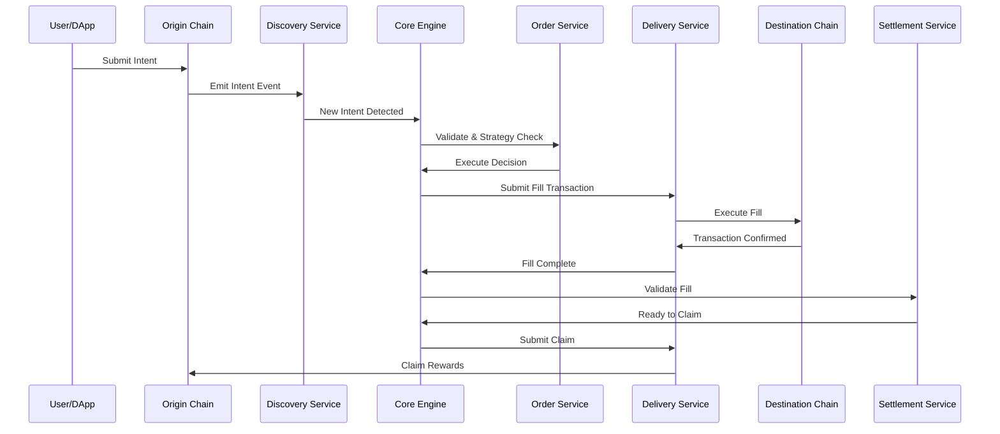
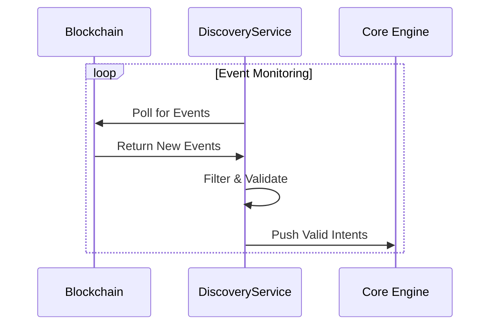
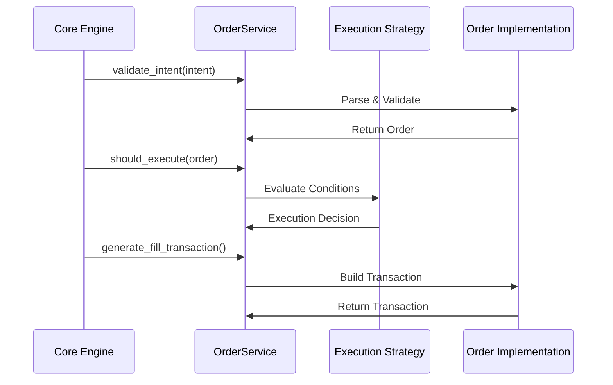
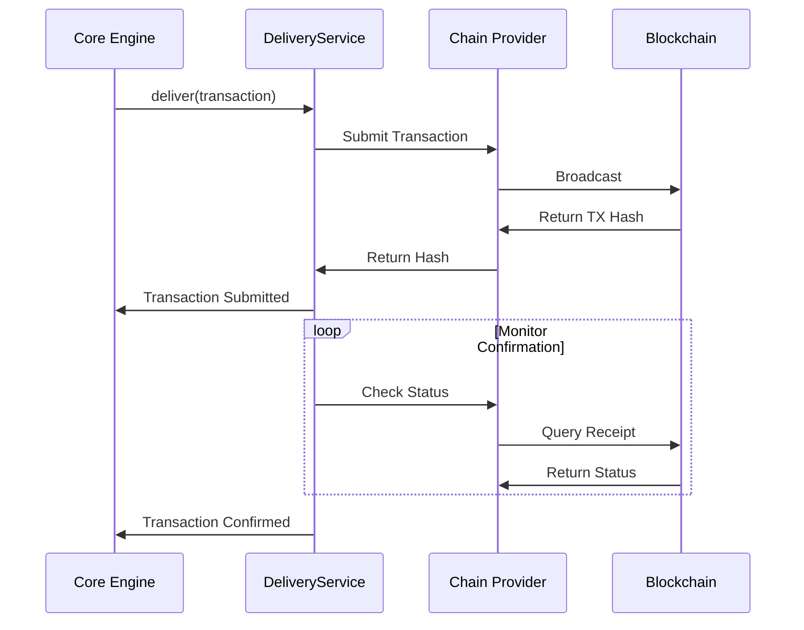
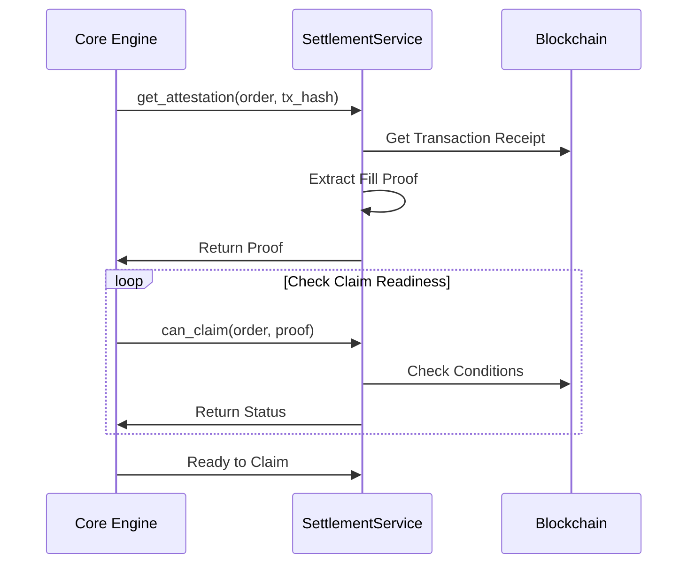
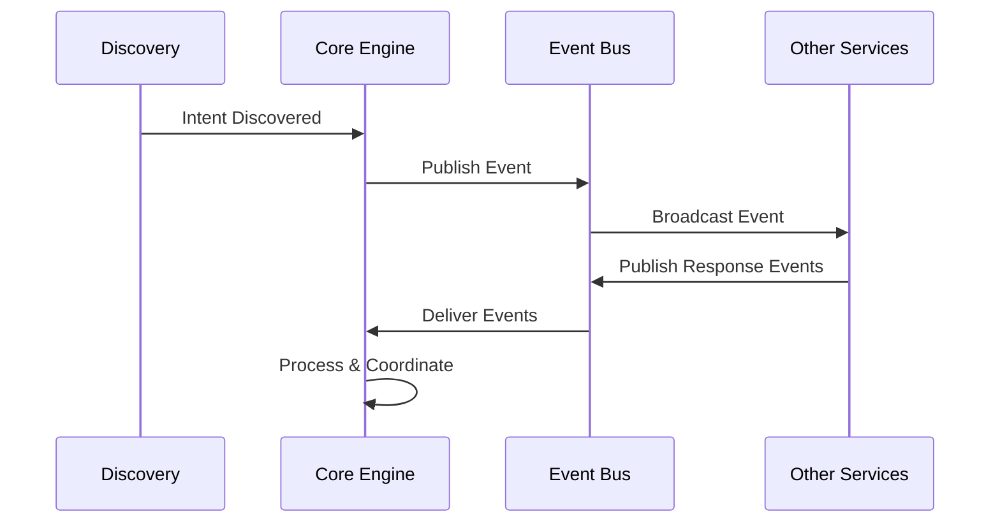

# OIF Solver Overview

## Summary

The OIF Solver is a high-performance cross-chain order execution system designed for the Open Intents Framework. It discovers intents across multiple blockchains, validates and executes orders through optimal paths, and manages settlement processes. The solver operates as an autonomous service that monitors blockchain events, makes intelligent execution decisions, and ensures reliable transaction delivery across heterogeneous blockchain networks.

## High-Level Project Structure

The OIF Solver uses Rust for its performance-critical requirements in cross-chain transaction execution. Rust provides zero-cost abstractions for the modular architecture, compile-time guarantees for concurrent blockchain monitoring across multiple chains, and predictable latency without garbage collection pauses, essential when competing to execute orders. The memory safety guarantees are crucial when handling cryptographic operations simultaneously.

```
oif-solver/
├── Cargo.toml                   # Workspace definition
├── crates/                      # Modular components
│   ├── solver-account/          # Cryptographic operations
│   ├── solver-config/           # Configuration management
│   ├── solver-core/             # Orchestration engine
│   ├── solver-delivery/         # Transaction submission
│   ├── solver-discovery/        # Intent monitoring
│   ├── solver-order/            # Order processing
│   ├── solver-service/          # Main executable
│   ├── solver-settlement/       # Settlement verification
│   ├── solver-storage/          # State persistence
│   └── solver-types/            # Shared types
├── config/                      # Configuration examples
└── scripts/                     # Deployment and demo scripts
```

## Directory Responsibilities

### Core Infrastructure

- **solver-types**: Common data structures and trait definitions shared across all modules
- **solver-config**: TOML-based configuration parsing and validation
- **solver-storage**: Persistent state management with custom backends
- **solver-account**: Secure key management and transaction signing

### Service Layer

- **solver-discovery**: Multi-chain event monitoring and intent detection
- **solver-order**: Intent validation, strategy evaluation, and transaction generation
- **solver-delivery**: Reliable transaction submission and confirmation monitoring
- **solver-settlement**: Fill validation and claim transaction management

### Orchestration

- **solver-core**: Event-driven orchestration of the entire order lifecycle
- **solver-service**: Binary entry point that wires up all components

## High-Level System Flow



## Module Deep Dive

### solver-discovery

Monitors multiple chains simultaneously for new intent events.



### solver-order

Processes intents through validation, strategy evaluation, and transaction generation.



### solver-delivery

Handles reliable transaction submission with monitoring and retry logic.



### solver-settlement

Validates fills and manages the claim process for completed orders.



### solver-core

Orchestrates the entire solver workflow through event-driven architecture.



## Conclusion

The OIF Solver represents a robust, performant solution for cross-chain order execution. Its modular architecture allows for easy extension and maintenance, while Rust's performance characteristics ensure it can compete effectively in the MEV-competitive environment of cross-chain execution. Each module can be used independently, making the solver both a complete solution and a toolkit for building custom cross-chain infrastructure.

The event-driven architecture ensures responsive processing of intents, while the clear separation of concerns makes the system easy to understand and extend. Whether used as a complete solver or as individual components, the OIF Solver provides the building blocks for sophisticated cross-chain execution strategies.
