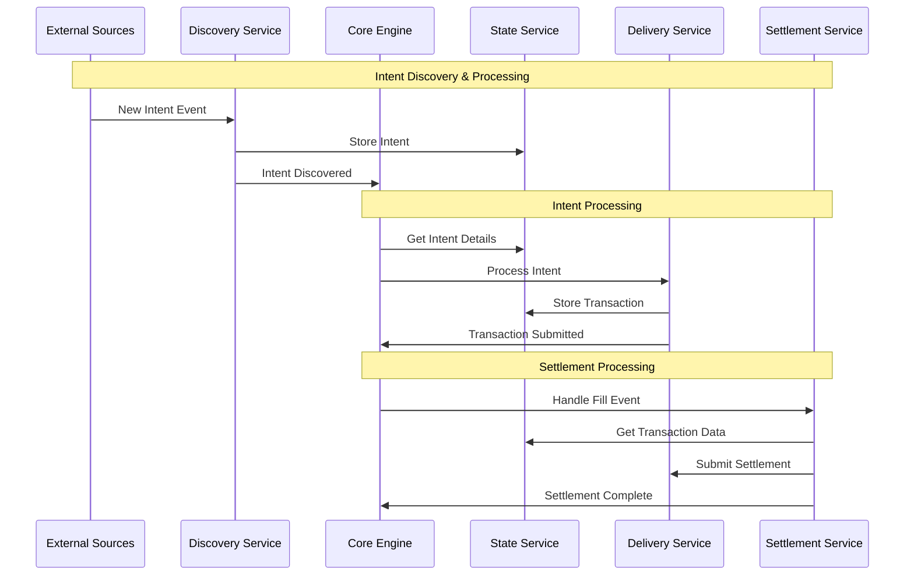

# OIF Solver

A high-performance cross-chain solver implementation for the Open Intents Framework (OIF). This solver enables efficient cross-chain order execution by discovering intents, finding optimal execution paths, and settling transactions across multiple blockchain networks.

## Overview

The OIF Solver is designed to:

- Discover and monitor cross-chain intents from multiple sources
- Find optimal execution paths across different chains and liquidity sources
- Execute transactions efficiently while minimizing costs
- Provide comprehensive monitoring and observability
- Support multiple order types and protocols (currently EIP-7683)

## High-Level Architecture



The solver uses a **plugin-based architecture** where each component can be extended through plugins without modifying core logic.

## Architecture

The solver is built as a modular Rust workspace with a **plugin-based architecture** that enables flexible extensibility:

- **solver-core**: Orchestrates the entire solver workflow and coordinates between services
- **solver-discovery**: Discovers new intents/orders from various blockchain and off-chain sources
- **solver-delivery**: Handles transaction preparation, submission, and monitoring across multiple chains
- **solver-settlement**: Manages settlement verification and claim processing after transaction execution
- **solver-state**: Provides persistent storage abstraction with TTL management for solver state
- **solver-plugin**: Contains concrete plugin implementations for different protocols and chains
- **solver-types**: Defines shared data structures, traits, and interfaces used across all components
- **solver-service**: Exposes HTTP API endpoints and CLI interface for external interaction

## Quick Start

```bash
# Build the project
cargo build

# Run tests
cargo test

# Run the solver service
cargo run --config config/local.toml --log-level debug
```

## Configuration

The solver can be configured using TOML files. See `config/` directory for examples:

- `config.toml` - Default configuration

### Validating Configuration

Configuration files are validated automatically when starting the solver. The solver will check if the configuration file is valid and report any errors before starting.

### Running with Custom Configuration

To use a custom configuration file:

```bash
# Using command line flag
cargo run -- --config path/to/your/config.toml

# Using environment variable
CONFIG_FILE=path/to/your/config.toml cargo run
```

### Log Levels

Available log levels (from most to least verbose):

- `trace` - Very detailed debugging information
- `debug` - Debugging information
- `info` - General information (default)
- `warn` - Warning messages
- `error` - Error messages only

Set the log level using:

```bash
# Command line flag
cargo run -- --log-level debug

# Short form
cargo run -- -l debug

# Environment variable
LOG_LEVEL=debug cargo run
```

## Running the Demo

The project includes a complete demo setup for testing cross-chain intent execution between two local chains.

### Prerequisites

- [Foundry](https://book.getfoundry.sh/getting-started/installation) (for Anvil, Forge, and Cast)
- Rust toolchain (stable)

### Step 1: Setup Local Test Environment

First, run the setup script to start two local blockchain nodes and deploy all necessary contracts:

```bash
# Make scripts executable (first time only)
chmod +x scripts/demo/*.sh

# Setup two local chains with all contracts deployed
./scripts/demo/setup_local_anvil.sh
```

This script will:

1. Start two Anvil instances:
   - Origin chain (ID: 31337) on port 8545
   - Destination chain (ID: 31338) on port 8546
2. Deploy test tokens on both chains
3. Deploy settler contracts (InputSettler, OutputSettler)
4. Deploy TheCompact contract for escrow
5. Create a `config/local.toml` configuration file
6. Fund test accounts with tokens

### Step 2: Start the Solver Service

In a new terminal, build and run the solver:

```bash
# Build the project
cargo build

# Run the solver with local configuration
cargo run --bin solver-service -- --config config/local.toml --log-level debug
```

The solver will:

- Connect to both local chains
- Start monitoring for new intents
- Listen on port 8080 for API requests

### Step 3: Run the Demo

In another terminal, execute the send intent script to create and observe a cross-chain intent:

```bash
# Send a cross-chain intent
./scripts/demo/send_intent.sh
```

This script will:

1. Show initial balances on both chains
2. Create a cross-chain intent (user deposits tokens on origin chain)
3. Wait for the solver to discover and fill the intent
4. Show final balances demonstrating successful execution

### What the Demo Demonstrates

1. **Intent Creation**: User deposits tokens into the InputSettler contract on the origin chain
2. **Discovery**: The solver detects the new intent through event monitoring
3. **Execution**: The solver fills the intent on the destination chain
4. **Settlement**: The solver claims rewards by providing attestations

### Monitoring the Demo

You can monitor the solver's activity through:

- Console logs (with debug level logging enabled)
- HTTP API endpoints:
  - `http://localhost:8080/health` - Health status
  - `http://localhost:8080/metrics` - Performance metrics
  - `http://localhost:8080/status` - Solver status

### Troubleshooting

If the demo doesn't work as expected:

1. Ensure all prerequisites are installed
2. Check that no other processes are using ports 8545, 8546, or 8080
3. Verify the solver is running and connected to both chains
4. Check solver logs for any error messages
5. Ensure you have sufficient balance in test accounts

## Development

This project uses a Rust workspace structure. Each crate is independently versioned and can be used separately.

### Building from Source

```bash
# Build all crates
cargo build --all

# Build in release mode
cargo build --release

# Run all tests
cargo test --all

# Run tests with output
cargo test --all -- --nocapture
```

### Code Structure

The codebase follows these conventions:

- Each crate has a focused responsibility
- Traits define interfaces between crates
- Types are shared through the `solver-types` crate
- Error handling uses the `Result` type with custom error variants
- Async runtime is Tokio
- Logging uses the `tracing` crate

## License

Licensed under MIT
