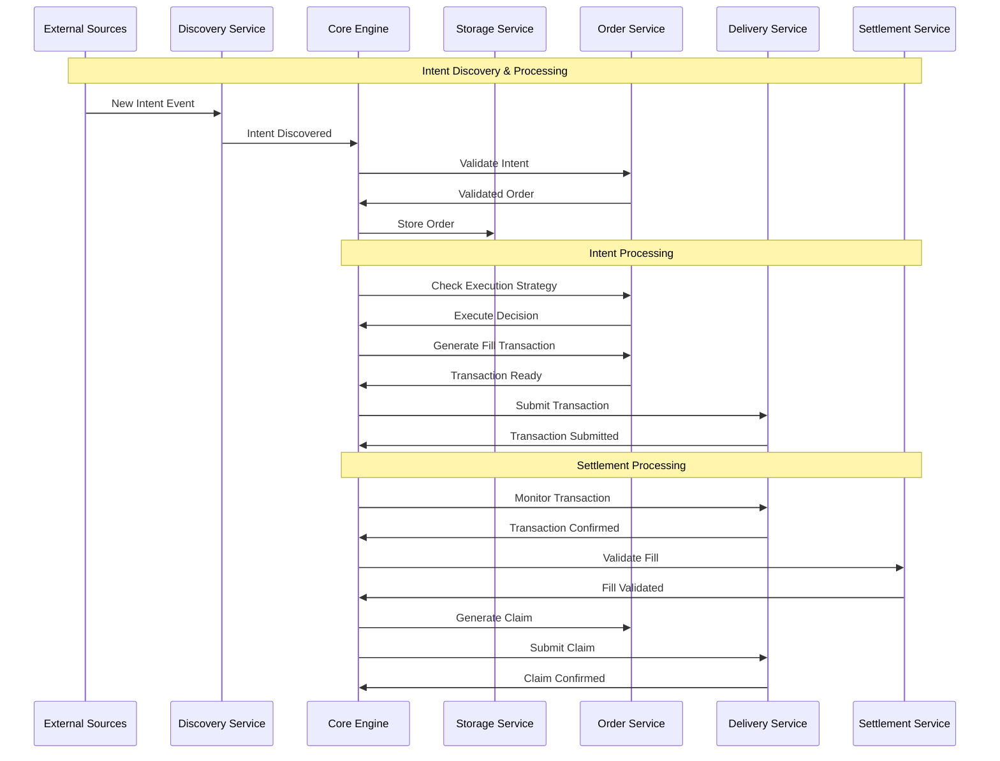

# OIF Solver

A high-performance cross-chain solver implementation for the Open Intents Framework (OIF). This solver enables efficient cross-chain order execution by discovering intents, finding optimal execution paths, and settling transactions across multiple blockchain networks.

## Overview

The OIF Solver is designed to:

* Discover and monitor cross-chain intents from multiple sources
* Find optimal execution paths across different chains and liquidity sources
* Execute transactions efficiently while minimizing costs
* Provide comprehensive monitoring and observability
* Support multiple order types and protocols (currently EIP-7683)

## High-Level Architecture



## Architecture

The solver is built as a modular Rust workspace with clearly defined service boundaries:

### Core Components

* **solver-core**: Orchestrates the entire solver workflow and coordinates between services
* **solver-types**: Defines shared data structures, traits, and interfaces used across all components
* **solver-config**: Handles configuration loading and validation
* **solver-storage**: Provides persistent storage abstraction with TTL management for solver state
* **solver-account**: Manages cryptographic keys and signing operations

### Service Components

* **solver-discovery**: Discovers new intents/orders from various blockchain and off-chain sources
* **solver-order**: Validates intents, manages execution strategies, and generates transactions
* **solver-delivery**: Handles transaction preparation, submission, and monitoring across multiple chains
* **solver-settlement**: Manages settlement verification and claim processing after transaction execution

### Binary

* **solver-service**: Main executable that wires up all components and runs the solver

## Project Structure

```
oif-solver/
├── Cargo.toml                       # Workspace definition
├── crates/
│   ├── solver-account/              # Account management and signing
│   │   ├── src/
│   │   │   ├── lib.rs               # Service interface
│   │   │   └── implementations/
│   │   │       └── local.rs         # Local key management
│   │   └── Cargo.toml
│   ├── solver-config/               # Configuration management
│   │   ├── src/
│   │   │   └── lib.rs               # Config structures and loading
│   │   └── Cargo.toml
│   ├── solver-core/                 # Core orchestration engine
│   │   ├── src/
│   │   │   ├── lib.rs               # Main solver engine
│   │   │   └── event_bus.rs         # Event-driven communication
│   │   └── Cargo.toml
│   ├── solver-delivery/             # Transaction delivery service
│   │   ├── src/
│   │   │   ├── lib.rs               # Service interface
│   │   │   └── implementations/
│   │   │       └── evm/
│   │   │           └── alloy.rs     # EVM chain delivery
│   │   └── Cargo.toml
│   ├── solver-discovery/            # Intent discovery service
│   │   ├── src/
│   │   │   ├── lib.rs               # Service interface
│   │   │   └── implementations/
│   │   │       └── onchain/
│   │   │           └── _7683.rs     # EIP-7683 discovery
│   │   └── Cargo.toml
│   ├── solver-order/                # Order processing service
│   │   ├── src/
│   │   │   ├── lib.rs               # Service interface
│   │   │   └── implementations/
│   │   │       ├── standards/
│   │   │       │   └── _7683.rs     # EIP-7683 orders
│   │   │       └── strategies/
│   │   │           └── simple.rs    # Simple execution strategy
│   │   └── Cargo.toml
│   ├── solver-service/              # Main binary
│   │   ├── src/
│   │   │   └── main.rs              # Entry point
│   │   └── Cargo.toml
│   ├── solver-settlement/           # Settlement service
│   │   ├── src/
│   │   │   ├── lib.rs               # Service interface
│   │   │   └── implementations/
│   │   │       └── direct.rs        # Direct settlement
│   │   └── Cargo.toml
│   ├── solver-storage/              # Storage abstraction
│   │   ├── src/
│   │   │   ├── lib.rs               # Service interface
│   │   │   └── implementations/
│   │   │       └── file.rs          # File-based storage
│   │   └── Cargo.toml
│   └── solver-types/                # Shared types
│       ├── src/
│       │   ├── lib.rs               # Type exports
│       │   ├── order.rs             # Order types
│       │   ├── discovery.rs         # Discovery types
│       │   ├── delivery.rs          # Delivery types
│       │   ├── settlement.rs        # Settlement types
│       │   └── events.rs            # Event types
│       └── Cargo.toml
├── config/
│   └── example.toml                 # Example configuration
└── scripts/
    └── demo/                        # Demo scripts
        ├── setup_local_anvil.sh
        └── send_intent.sh
```

## Component Responsibilities

### solver-core

* Orchestrates the entire order lifecycle
* Manages event-driven communication between services
* Implements the main solver loop
* Handles graceful shutdown
* Provides factory pattern for building solver instances

### solver-discovery

* Monitors blockchain events for new intents
* Supports multiple discovery sources simultaneously
* Filters and validates discovered intents
* Pushes valid intents to the core engine

### solver-order

* Validates intents and converts them to orders
* Implements execution strategies (when to execute)
* Generates fill and claim transactions
* Manages order-specific logic for different protocols

### solver-delivery

* Submits transactions to multiple blockchains
* Monitors transaction confirmation status
* Manages gas estimation and pricing
* Handles transaction retries and failures

### solver-settlement

* Validates fill transactions
* Extracts and stores fill proofs
* Monitors when orders can be claimed
* Manages dispute periods and oracle interactions

### solver-storage

* Provides persistent storage for orders and state
* Implements TTL (time-to-live) for temporary data
* Supports different storage backends
* Ensures data consistency across services

### solver-account

* Manages private keys and signing operations
* Supports different key management backends
* Provides secure signing for transactions
* Handles address derivation

## Quick Start

```bash
# Build the project
cargo build

# Run tests
cargo test

# Run the solver service with info logs
cargo run -- --config config/example.toml

# Run with debug logs for solver modules only
RUST_LOG=solver_core=debug,solver_delivery=debug,info cargo run -- --config config/example.toml
```

## Configuration

The solver uses TOML configuration files. See `config/example.toml` for a complete example:

```toml
# Solver identity and settings
[solver]
id = "my-solver"
monitoring_timeout_minutes = 5

# Storage backend configuration
[storage]
backend = "file"
[storage.config]
storage_path = "./data/storage"

# Account management
[account]
provider = "local"
[account.config]
private_key = "0x..."

# Delivery providers for different chains
[delivery]
min_confirmations = 1
[delivery.providers.origin]
rpc_url = "http://localhost:8545"
chain_id = 31337

# Discovery sources
[discovery.sources.origin_eip7683]
rpc_url = "http://localhost:8545"
settler_addresses = ["0x..."]

# Order processing
[order.implementations.eip7683]
output_settler_address = "0x..."
[order.execution_strategy]
strategy_type = "simple"

# Settlement configuration
[settlement.implementations.eip7683]
rpc_url = "http://localhost:8546"
```

### Running with Custom Configuration

```bash
# Using command line flag
cargo run -- --config path/to/your/config.toml

# Using environment variable
CONFIG_FILE=path/to/your/config.toml cargo run
```

### Logging Configuration

The solver uses the `RUST_LOG` environment variable for fine-grained logging control. You can specify different log levels for different modules:

```bash
# Show debug logs for solver modules only
RUST_LOG=solver_core=debug,solver_delivery=debug,info cargo run -- --config config/demo.toml

# Reduce noise from external crates
RUST_LOG=info,hyper=warn,alloy_provider=warn cargo run -- --config config/demo.toml

# Debug specific modules
RUST_LOG=solver_core=debug,solver_delivery=info,alloy=warn,hyper=warn cargo run -- --config config/demo.toml

# Show all debug logs (very verbose)
RUST_LOG=debug cargo run -- --config config/demo.toml
```

Available log levels (from most to least verbose):
* `trace` - Very detailed debugging information
* `debug` - Debugging information
* `info` - General information (default)
* `warn` - Warning messages
* `error` - Error messages only

The `--log-level` flag acts as a fallback when `RUST_LOG` is not set:

```bash
# Uses info level for all modules when RUST_LOG is not set
cargo run -- --config config/demo.toml --log-level info
```

## Running the Demo

The project includes a complete demo setup for testing cross-chain intent execution between two local chains.

### Prerequisites

* [Foundry](https://book.getfoundry.sh/getting-started/installation) (for Anvil, Forge, and Cast)
* Rust toolchain (stable)

### Step 1: Setup Local Test Environment

First, run the setup script to start two local blockchain nodes and deploy all necessary contracts:

```bash
# Make scripts executable (first time only)
chmod +x scripts/demo/*.sh

# Setup two local chains with all contracts deployed
./scripts/demo/setup_local_anvil.sh
```

This script will:

1. Start two Anvil instances:
   * Origin chain (ID: 31337) on port 8545
   * Destination chain (ID: 31338) on port 8546
2. Deploy test tokens on both chains
3. Deploy settler contracts (InputSettler, OutputSettler)
4. Create a `config/demo.toml` configuration file
5. Fund test accounts with tokens
6. Approves token spend for settler contracts

### Step 2: Start the Solver Service

In a new terminal, build and run the solver:

```bash
# Build the project
cargo build

# Run the solver with local configuration
cargo run --bin solver -- --config config/demo.toml

# Or with debug logs for debugging
RUST_LOG=solver_core=debug,solver_delivery=info,info cargo run --bin solver -- --config config/demo.toml
```

The solver will:

* Connect to both local chains
* Start monitoring for new intents
* Process discovered intents automatically

### Step 3: Run the Demo

In another terminal, execute the send intent script to create and observe a cross-chain intent:

```bash
# Send a cross-chain intent
./scripts/demo/send_intent.sh
```

This script will:

1. Show initial balances on both chains
2. Create a cross-chain intent (user deposits tokens on origin chain)
3. Wait for the solver to discover and fill the intent
4. Show final balances demonstrating successful execution

### What the Demo Demonstrates

1. **Intent Creation**: User deposits tokens into the InputSettler contract on the origin chain
2. **Discovery**: The solver detects the new intent through event monitoring
3. **Execution**: The solver fills the intent on the destination chain
4. **Settlement**: The solver claims rewards by providing attestations

### Monitoring the Demo

You can monitor the solver's activity through:

* Console logs (with debug level logging enabled)
* Storage files in `./data/storage/` (when using file storage backend)

### Troubleshooting

If the demo doesn't work as expected:

1. Ensure all prerequisites are installed
2. Check that no other processes are using ports 8545, 8546
3. Verify the solver is running and connected to both chains
4. Check solver logs for any error messages
5. Ensure you have sufficient balance in test accounts

## Development

This project uses a Rust workspace structure. Each crate is independently versioned and can be used separately.

### Building from Source

```bash
# Build all crates
cargo build --all

# Build in release mode
cargo build --release

# Run all tests
cargo test --all

# Run tests with output
cargo test --all -- --nocapture
```

## License

Licensed under MIT
